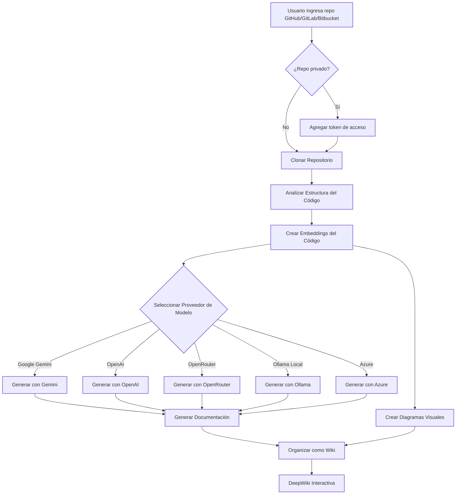

### ⚠️ Anuncio: Cambiando el enfoque a AsyncReview
---

**ACTUALIZACIÓN IMPORTANTE** El mantenimiento de DeepWiki-Open continúa, pero el desarrollo activo principal se está trasladando a **[AsyncReview](https://github.com/AsyncFuncAI/AsyncReview/)**. Gracias por el apoyo en este proyecto; por favor únete al nuevo repositorio para el esfuerzo principal de este año.

---
---

# DeepWiki-Open


**DeepWiki** es mi propia implementación de DeepWiki, que crea automáticamente wikis hermosas e interactivas para cualquier repositorio de GitHub, GitLab o BitBucket. ¡Solo ingresa el nombre de un repositorio y DeepWiki:

1. Analizará la estructura del código
2. Generará documentación completa
3. Creará diagramas visuales para explicar cómo funciona todo
4. Organizará todo en una wiki fácil de navegar

[](https://buymeacoffee.com/sheing)
[](https://tip.md/sng-asyncfunc)
[](https://x.com/sashimikun_void)
[](https://discord.com/invite/VQMBGR8u5v)

[English](./README.md) | [简体中文](./README.zh.md) | [繁體中文](./README.zh-tw.md) | [日本語](./README.ja.md) | [Español](./README.es.md) | [한국어](./README.kr.md) | [Tiếng Việt](./README.vi.md) | [Português Brasileiro](./README.pt-br.md) | [Français](./README.fr.md) | [Русский](./README.ru.md)

## ✨ Características

- **Documentación Instantánea**: Convierte cualquier repositorio de GitHub, GitLab o BitBucket en una wiki en segundos
- **Soporte para Repositorios Privados**: Accede de forma segura a repositorios privados con tokens de acceso personal
- **Análisis Inteligente**: Comprensión de la estructura y relaciones del código impulsada por IA
- **Diagramas Hermosos**: Diagramas Mermaid automáticos para visualizar la arquitectura y el flujo de datos
- **Navegación Sencilla**: Interfaz simple e intuitiva para explorar la wiki
- **Función de Preguntas**: Chatea con tu repositorio usando IA potenciada por RAG para obtener respuestas precisas
- **Investigación Profunda**: Proceso de investigación de múltiples turnos que examina a fondo temas complejos
- **Múltiples Proveedores de Modelos**: Soporte para Google Gemini, OpenAI, OpenRouter y modelos locales de Ollama
- **Embeddings Flexibles**: Elige entre embeddings de OpenAI, Google AI u Ollama local para un rendimiento óptimo

### Funciones Empresariales

- **GitLab SSO**: Inicio de sesión único basado en OAuth2 con instancias GitLab
- **Panel de Administración**: Indexación por lotes, gestión de proyectos, monitoreo del sistema
- **Servidor MCP**: Endpoint [Model Context Protocol](https://modelcontextprotocol.io/) autenticado con JWT — conecta Claude Code, Codex u otros clientes MCP a tu código
- **Gestión de Productos**: Agrupa múltiples repositorios en productos lógicos para análisis cruzado
- **Relaciones entre Repositorios**: Visualización automática del grafo de dependencias
- **Ask Global**: Preguntas y respuestas entre todos los proyectos indexados
- **Insights Estructurados**: Extracción de módulos, endpoints API, modelos de datos y stack tecnológico mediante LLM
- **Sistema de Permisos**: Control de acceso basado en GitLab con caché en memoria (5 min por proyecto, 24h para lista de proyectos)

## 🚀 Inicio Rápido (¡Súper Fácil!)

### Opción 1: Usando Docker

```bash
# Clonar el repositorio
git clone https://github.com/AsyncFuncAI/deepwiki-open.git
cd deepwiki-open

# Crear un archivo .env con tus claves API
echo "GOOGLE_API_KEY=your_google_api_key" > .env
echo "OPENAI_API_KEY=your_openai_api_key" >> .env
# Opcional: Usar embeddings de Google AI en lugar de OpenAI (recomendado si usas modelos de Google)
echo "DEEPWIKI_EMBEDDER_TYPE=google" >> .env
# Opcional: Añadir clave API de OpenRouter si quieres usar modelos de OpenRouter
echo "OPENROUTER_API_KEY=your_openrouter_api_key" >> .env
# Opcional: Añadir host de Ollama si no es local. Por defecto: http://localhost:11434
echo "OLLAMA_HOST=your_ollama_host" >> .env
# Opcional: Añadir clave API de Azure, endpoint y versión si quieres usar modelos de Azure OpenAI
echo "AZURE_OPENAI_API_KEY=your_azure_openai_api_key" >> .env
echo "AZURE_OPENAI_ENDPOINT=your_azure_openai_endpoint" >> .env
echo "AZURE_OPENAI_VERSION=your_azure_openai_version" >> .env
# Ejecutar con Docker Compose
docker-compose up
```

Para instrucciones detalladas sobre cómo usar DeepWiki con Ollama y Docker, consulta [Instrucciones de Ollama](Ollama-instruction.md).

> 💡 **Dónde obtener estas claves:**
> - Obtén una clave API de Google en [Google AI Studio](https://makersuite.google.com/app/apikey)
> - Obtén una clave API de OpenAI en [OpenAI Platform](https://platform.openai.com/api-keys)
> - Obtén credenciales de Azure OpenAI en [Azure Portal](https://portal.azure.com/) - crea un recurso Azure OpenAI y obtén la clave API, el endpoint y la versión de la API

### Opción 2: Configuración Manual (Recomendada)

#### Paso 1: Configurar tus Claves API

Crea un archivo `.env` en la raíz del proyecto con estas claves:

```
GOOGLE_API_KEY=your_google_api_key
OPENAI_API_KEY=your_openai_api_key
# Opcional: Usar embeddings de Google AI (recomendado si usas modelos de Google)
DEEPWIKI_EMBEDDER_TYPE=google
# Opcional: Añade esto si quieres usar modelos de OpenRouter
OPENROUTER_API_KEY=your_openrouter_api_key
# Opcional: Añade esto si quieres usar modelos de Azure OpenAI
AZURE_OPENAI_API_KEY=your_azure_openai_api_key
AZURE_OPENAI_ENDPOINT=your_azure_openai_endpoint
AZURE_OPENAI_VERSION=your_azure_openai_version
# Opcional: Añadir host de Ollama si no es local. Por defecto: http://localhost:11434
OLLAMA_HOST=your_ollama_host
```

#### Paso 2: Iniciar el Backend

```bash
# Instalar dependencias de Python
python -m pip install poetry==2.0.1 && poetry install -C api

# Iniciar el servidor API
python -m api.main
```

#### Paso 3: Iniciar el Frontend

```bash
# Instalar dependencias de JavaScript
npm install
# o
yarn install

# Iniciar la aplicación web
npm run dev
# o
yarn dev
```

#### Paso 4: ¡Usar DeepWiki!

1. Abre [http://localhost:3000](http://localhost:3000) en tu navegador
2. Ingresa un repositorio de GitHub, GitLab o Bitbucket (como `https://github.com/openai/codex`, `https://github.com/microsoft/autogen`, `https://gitlab.com/gitlab-org/gitlab`, o `https://bitbucket.org/redradish/atlassian_app_versions`)
3. Para repositorios privados, haz clic en "+ Agregar tokens de acceso" e ingresa tu token de acceso personal de GitHub o GitLab
4. ¡Haz clic en "Generar Wiki" y observa la magia suceder!

## 🔍 Cómo Funciona

DeepWiki usa IA para:

1. Clonar y analizar el repositorio de GitHub, GitLab o Bitbucket (incluyendo repos privados con autenticación por token)
2. Crear embeddings del código para recuperación inteligente
3. Generar documentación con IA consciente del contexto (usando modelos de Google Gemini, OpenAI, OpenRouter, Azure OpenAI u Ollama local)
4. Crear diagramas visuales para explicar las relaciones del código
5. Organizar todo en una wiki estructurada
6. Habilitar preguntas y respuestas inteligentes con el repositorio a través de la función de Preguntas
7. Proporcionar capacidades de investigación en profundidad con Investigación Profunda



## 🛠️ Estructura del Proyecto

```
deepwiki/
├── api/                        # Servidor API backend
│   ├── main.py                 # Punto de entrada (uvicorn)
│   ├── api.py                  # App FastAPI, endpoints REST/WebSocket
│   ├── gitlab_auth.py          # OAuth2 SSO de GitLab, JWT, token MCP
│   ├── gitlab_permission.py    # Verificación de permisos de repo + caché
│   ├── admin.py                # Rutas de API de administración
│   ├── batch_indexer.py        # Indexación por lotes en segundo plano
│   ├── mcp_server.py           # Servidor MCP (autenticado con JWT)
│   ├── metadata_store.py       # Almacén JSON de metadatos de índice
│   ├── product_manager.py      # CRUD de productos
│   ├── repo_relations.py       # Análisis de dependencias entre repos
│   ├── insight_extractor.py    # Extracción de conocimiento estructurado
│   ├── wiki_generator.py       # Lógica central de generación de wiki
│   ├── rag.py                  # RAG de un solo repositorio
│   ├── multi_rag.py            # RAG multi-repositorio
│   ├── data_pipeline.py        # Clonación de repos, embeddings
│   ├── config.py               # Cargador de configuración, variables de entorno
│   ├── prompts.py              # Plantillas de prompts para LLM
│   ├── config/                 # Archivos de configuración JSON
│   └── *_client.py             # Clientes de proveedores de LLM
│
├── src/                        # App frontend Next.js
│   ├── app/
│   │   ├── page.tsx            # Inicio (login SSO, lista de proyectos)
│   │   ├── [owner]/[repo]/     # Visor de wiki
│   │   ├── admin/              # Panel de administración
│   │   ├── admin/relations/    # Grafo de dependencias de repos
│   │   ├── ask/                # Consulta Global (Q&A entre repos)
│   │   └── auth/callback/      # Callback OAuth
│   ├── components/             # Componentes React
│   └── contexts/               # Contextos de Auth, Idioma
│
├── public/                     # Activos estáticos
├── package.json                # Dependencias JavaScript
└── .env                        # Variables de entorno (crear este archivo)
```

## 🤖 Sistema de Selección de Modelos Basado en Proveedores

DeepWiki ahora implementa un sistema flexible de selección de modelos basado en proveedores que soporta múltiples proveedores de LLM:

### Proveedores y Modelos Soportados

- **Google**: Predeterminado `gemini-2.5-flash`, también soporta `gemini-2.5-flash-lite`, `gemini-2.5-pro`, etc.
- **OpenAI**: Predeterminado `gpt-5-nano`, también soporta `gpt-5`, `4o`, etc.
- **OpenRouter**: Acceso a múltiples modelos a través de una API unificada, incluyendo Claude, Llama, Mistral, etc.
- **Azure OpenAI**: Predeterminado `gpt-4o`, también soporta `o4-mini`, etc.
- **Ollama**: Soporte para modelos de código abierto ejecutados localmente como `llama3`

### Variables de Entorno

Cada proveedor requiere sus correspondientes variables de entorno para las claves API:

```
# Claves API
GOOGLE_API_KEY=tu_clave_api_google        # Requerida para modelos Google Gemini
OPENAI_API_KEY=tu_clave_api_openai        # Requerida para modelos OpenAI
OPENROUTER_API_KEY=tu_clave_api_openrouter # Requerida para modelos OpenRouter
AZURE_OPENAI_API_KEY=tu_clave_api_azure_openai  # Requerida para modelos Azure OpenAI
AZURE_OPENAI_ENDPOINT=tu_endpoint_azure_openai  # Requerida para modelos Azure OpenAI
AZURE_OPENAI_VERSION=tu_version_azure_openai  # Requerida para modelos Azure OpenAI

# Configuración de URL Base de OpenAI API
OPENAI_BASE_URL=https://punto-final-personalizado.com/v1  # Opcional, para endpoints personalizados de OpenAI API

# Host de Ollama
OLLAMA_HOST=tu_host_ollama # Opcional, si Ollama no es local. Por defecto: http://localhost:11434

# Directorio de Configuración
DEEPWIKI_CONFIG_DIR=/ruta/a/directorio/config/personalizado  # Opcional, para ubicación personalizada de archivos de configuración
```

### Archivos de Configuración

DeepWiki utiliza archivos de configuración JSON para gestionar varios aspectos del sistema:

1. **`generator.json`**: Configuración para modelos de generación de texto
   - Define los proveedores de modelos disponibles (Google, OpenAI, OpenRouter, Azure, Ollama)
   - Especifica los modelos predeterminados y disponibles para cada proveedor
   - Contiene parámetros específicos de los modelos como temperatura y top_p

2. **`embedder.json`**: Configuración para modelos de embeddings y procesamiento de texto
   - Define modelos de embeddings para almacenamiento vectorial
   - Contiene configuración del recuperador para RAG
   - Especifica ajustes del divisor de texto para fragmentación de documentos

3. **`repo.json`**: Configuración para manejo de repositorios
   - Contiene filtros de archivos para excluir ciertos archivos y directorios
   - Define límites de tamaño de repositorio y reglas de procesamiento

Por defecto, estos archivos se encuentran en el directorio `api/config/`. Puedes personalizar su ubicación usando la variable de entorno `DEEPWIKI_CONFIG_DIR`.

### Selección de Modelos Personalizados para Proveedores de Servicios

La función de selección de modelos personalizados está diseñada específicamente para proveedores de servicios que necesitan:

- Puede ofrecer a los usuarios dentro de su organización una selección de diferentes modelos de IA
- Puede adaptarse rápidamente al panorama de LLM en rápida evolución sin cambios de código
- Puede soportar modelos especializados o ajustados que no están en la lista predefinida

Usted puede implementar sus ofertas de modelos seleccionando entre las opciones predefinidas o ingresando identificadores de modelos personalizados en la interfaz frontend.

### Configuración de URL Base para Canales Privados Empresariales

La configuración de base_url del Cliente OpenAI está diseñada principalmente para usuarios empresariales con canales API privados. Esta función:

- Permite la conexión a endpoints API privados o específicos de la empresa
- Permite a las organizaciones usar sus propios servicios LLM auto-alojados o desplegados a medida
- Soporta integración con servicios de terceros compatibles con la API de OpenAI

**Próximamente**: En futuras actualizaciones, DeepWiki soportará un modo donde los usuarios deberán proporcionar sus propias claves API en las solicitudes. Esto permitirá a los clientes empresariales con canales privados utilizar sus disposiciones API existentes sin compartir credenciales con el despliegue de DeepWiki.

## 🧩 Uso de modelos de embedding compatibles con OpenAI (por ejemplo, Alibaba Qwen)

Si deseas usar modelos de embedding compatibles con la API de OpenAI (como Alibaba Qwen), sigue estos pasos:

1. Sustituye el contenido de `api/config/embedder.json` por el de `api/config/embedder_openai_compatible.json`.
2. En el archivo `.env` de la raíz del proyecto, configura las variables de entorno necesarias, por ejemplo:
   ```
   OPENAI_API_KEY=tu_api_key
   OPENAI_BASE_URL=tu_endpoint_compatible_openai
   ```
3. El programa sustituirá automáticamente los placeholders de embedder.json por los valores de tus variables de entorno.

Así puedes cambiar fácilmente a cualquier servicio de embedding compatible con OpenAI sin modificar el código.

## 🧠 Uso de Embeddings de Google AI

DeepWiki ahora soporta los últimos modelos de embeddings de Google AI como alternativa a los embeddings de OpenAI. Esto proporciona una mejor integración cuando ya estás usando modelos de Google Gemini para la generación de texto.

### Características

- **Último Modelo**: Usa el modelo `text-embedding-004` de Google
- **Misma Clave API**: Usa tu `GOOGLE_API_KEY` existente (no requiere configuración adicional)
- **Mejor Integración**: Optimizado para usar con modelos de generación de texto de Google Gemini
- **Específico por Tarea**: Soporta similitud semántica, recuperación y tareas de clasificación
- **Procesamiento por Lotes**: Procesamiento eficiente de múltiples textos

### Cómo Habilitar los Embeddings de Google AI

**Opción 1: Variable de Entorno (Recomendada)**

Configura el tipo de embedder en tu archivo `.env`:

```bash
# Tu clave API de Google existente
GOOGLE_API_KEY=tu_clave_api_google

# Habilitar embeddings de Google AI
DEEPWIKI_EMBEDDER_TYPE=google
```

**Opción 2: Entorno Docker**

```bash
docker run -p 8001:8001 -p 3000:3000 \
  -e GOOGLE_API_KEY=tu_clave_api_google \
  -e DEEPWIKI_EMBEDDER_TYPE=google \
  -v ~/.adalflow:/root/.adalflow \
  ghcr.io/asyncfuncai/deepwiki-open:latest
```

**Opción 3: Docker Compose**

Añade a tu archivo `.env`:

```bash
GOOGLE_API_KEY=tu_clave_api_google
DEEPWIKI_EMBEDDER_TYPE=google
```

Luego ejecuta:

```bash
docker-compose up
```

### Tipos de Embedder Disponibles

| Tipo | Descripción | Clave API Requerida | Notas |
|------|-------------|---------------------|-------|
| `openai` | Embeddings de OpenAI (por defecto) | `OPENAI_API_KEY` | Usa el modelo `text-embedding-3-small` |
| `google` | Embeddings de Google AI | `GOOGLE_API_KEY` | Usa el modelo `text-embedding-004` |
| `ollama` | Embeddings locales de Ollama | Ninguna | Requiere instalación local de Ollama |

### ¿Por Qué Usar Embeddings de Google AI?

- **Consistencia**: Si usas Google Gemini para generación de texto, usar embeddings de Google proporciona mejor consistencia semántica
- **Rendimiento**: El último modelo de embeddings de Google ofrece un rendimiento excelente para tareas de recuperación
- **Costo**: Precios competitivos comparados con OpenAI
- **Sin Configuración Adicional**: Usa la misma clave API que tus modelos de generación de texto

### Cambiar entre Embedders

Puedes cambiar fácilmente entre diferentes proveedores de embeddings:

```bash
# Usar embeddings de OpenAI (por defecto)
export DEEPWIKI_EMBEDDER_TYPE=openai

# Usar embeddings de Google AI
export DEEPWIKI_EMBEDDER_TYPE=google

# Usar embeddings locales de Ollama
export DEEPWIKI_EMBEDDER_TYPE=ollama
```

**Nota**: Al cambiar de embedder, es posible que necesites regenerar los embeddings de tu repositorio ya que diferentes modelos producen diferentes espacios vectoriales.

### Registro de Actividad

DeepWiki usa el módulo `logging` integrado de Python para la salida de diagnóstico. Puedes configurar la verbosidad y el destino del archivo de registro mediante variables de entorno:

| Variable        | Descripción                                                          | Por Defecto                  |
|-----------------|----------------------------------------------------------------------|------------------------------|
| `LOG_LEVEL`     | Nivel de registro (DEBUG, INFO, WARNING, ERROR, CRITICAL).           | INFO                         |
| `LOG_FILE_PATH` | Ruta al archivo de registro. Si se establece, los registros se escribirán en este archivo. | `api/logs/application.log`   |

Para habilitar el registro de depuración y dirigir los registros a un archivo personalizado:
```bash
export LOG_LEVEL=DEBUG
export LOG_FILE_PATH=./debug.log
python -m api.main
```
O con Docker Compose:
```bash
LOG_LEVEL=DEBUG LOG_FILE_PATH=./debug.log docker-compose up
```

Cuando se ejecuta con Docker Compose, el directorio `api/logs` del contenedor se monta en `./api/logs` en tu host (consulta la sección `volumes` en `docker-compose.yml`), asegurando que los archivos de registro persistan entre reinicios.

Alternativamente, puedes almacenar esta configuración en tu archivo `.env`:

```bash
LOG_LEVEL=DEBUG
LOG_FILE_PATH=./debug.log
```
Luego simplemente ejecuta:

```bash
docker-compose up
```

**Consideraciones de Seguridad en Rutas de Registro:** En entornos de producción, asegúrate de que el directorio `api/logs` y cualquier ruta personalizada de archivo de registro estén protegidos con permisos de sistema de archivos y controles de acceso apropiados. La aplicación obliga a que `LOG_FILE_PATH` resida dentro del directorio `api/logs` del proyecto para prevenir traversal de rutas o escrituras no autorizadas.

## 🛠️ Configuración Avanzada

### Variables de Entorno

| Variable | Descripción | Requerida | Nota |
|---|---|---|---|
| **Proveedores de LLM** ||||
| `GOOGLE_API_KEY` | Clave API de Google Gemini | No | Requerida para modelos Gemini y embeddings de Google |
| `OPENAI_API_KEY` | Clave API de OpenAI | Condicional | Requerida si se usan embeddings o modelos de OpenAI |
| `OPENROUTER_API_KEY` | Clave API de OpenRouter | No | Requerida para modelos de OpenRouter |
| `AZURE_OPENAI_API_KEY` | Clave API de Azure OpenAI | No | Requerida para modelos de Azure OpenAI |
| `AZURE_OPENAI_ENDPOINT` | Endpoint de Azure OpenAI | No | Requerido para modelos de Azure OpenAI |
| `AZURE_OPENAI_VERSION` | Versión de Azure OpenAI | No | Requerida para modelos de Azure OpenAI |
| `OLLAMA_HOST` | Host de Ollama (por defecto: http://localhost:11434) | No | Requerido para servidor Ollama externo |
| `DEEPWIKI_EMBEDDER_TYPE` | Embedder: `openai`, `google`, `ollama`, `bedrock` | No | Por defecto: `openai` |
| **AWS Bedrock** ||||
| `AWS_ACCESS_KEY_ID` | Clave de acceso AWS | No | Requerida para Bedrock sin autenticación basada en roles |
| `AWS_SECRET_ACCESS_KEY` | Clave secreta AWS | No | Requerida para Bedrock sin autenticación basada en roles |
| `AWS_REGION` | Región AWS (por defecto: `us-east-1`) | No | |
| `AWS_ROLE_ARN` | ARN del rol AWS a asumir | No | Si se establece, usa STS AssumeRole |
| **GitLab Empresarial** ||||
| `GITLAB_URL` | URL de la instancia GitLab | No | Requerida para SSO y funciones empresariales |
| `GITLAB_CLIENT_ID` | ID de aplicación OAuth2 | No | Requerido para GitLab SSO |
| `GITLAB_CLIENT_SECRET` | Secreto de aplicación OAuth2 | No | Requerido para GitLab SSO |
| `GITLAB_SERVICE_TOKEN` | Token de cuenta de servicio | No | Requerido para indexación por lotes y acceso MCP a repos |
| `JWT_SECRET_KEY` | Secreto de firma JWT | No | Requerido cuando SSO está habilitado |
| `ADMIN_USERNAMES` | Nombres de usuario admin separados por comas | No | Controla acceso al panel de administración |
| `PERMISSION_CACHE_TTL` | TTL de caché de permisos en segundos | No | Por defecto: 300 |
| `FRONTEND_ORIGIN` | URL del frontend para callbacks OAuth | No | Por defecto: http://localhost:3000 |
| **Servidor** ||||
| `PORT` | Puerto del servidor API (por defecto: 8001) | No | |
| `SERVER_BASE_URL` | URL del backend para proxy del frontend | No | Por defecto: http://localhost:8001 |
| `DEEPWIKI_CONFIG_DIR` | Directorio de configuración personalizado | No | Por defecto: `api/config/` |
| `DEEPWIKI_AUTH_MODE` | Habilitar modo de código de autenticación (`true`/`1`) | No | Autenticación simple para despliegues sin SSO |
| `DEEPWIKI_AUTH_CODE` | Código de autenticación para generación de wiki | No | Solo se usa con `DEEPWIKI_AUTH_MODE` |

**Requisitos de Claves API:**
- Si se usa `DEEPWIKI_EMBEDDER_TYPE=openai` (por defecto): `OPENAI_API_KEY` es requerida
- Si se usa `DEEPWIKI_EMBEDDER_TYPE=google`: `GOOGLE_API_KEY` es requerida
- Si se usa `DEEPWIKI_EMBEDDER_TYPE=ollama`: No se requiere clave API (procesamiento local)
- Si se usa `DEEPWIKI_EMBEDDER_TYPE=bedrock`: Se requieren credenciales AWS (o credenciales basadas en roles)

Otras claves API solo son requeridas cuando se configuran y usan modelos de los proveedores correspondientes.

## Modo de Autorización

DeepWiki puede configurarse para ejecutarse en modo de autorización, donde la generación de wikis requiere un código de autorización válido. Esto es útil si quieres controlar quién puede usar la función de generación.
Restringe la iniciación desde el frontend y protege la eliminación de caché, pero no previene completamente la generación en el backend si los endpoints de la API se acceden directamente.

Para habilitar el modo de autorización, configura las siguientes variables de entorno:

- `DEEPWIKI_AUTH_MODE`: Establece esto como `true` o `1`. Cuando está habilitado, el frontend mostrará un campo de entrada para el código de autorización.
- `DEEPWIKI_AUTH_CODE`: Establece esto con el código secreto deseado. Restringe la iniciación desde el frontend y protege la eliminación de caché, pero no previene completamente la generación en el backend si los endpoints de la API se acceden directamente.

Si `DEEPWIKI_AUTH_MODE` no está configurado o está establecido como `false` (o cualquier otro valor que no sea `true`/`1`), la función de autorización estará deshabilitada y no se requerirá ningún código.

### Configuración con Docker

Puedes usar Docker para ejecutar DeepWiki:

#### Ejecutar el Contenedor

```bash
# Descargar la imagen del GitHub Container Registry
docker pull ghcr.io/asyncfuncai/deepwiki-open:latest

# Ejecutar el contenedor con variables de entorno
docker run -p 8001:8001 -p 3000:3000 \
  -e GOOGLE_API_KEY=tu_clave_api_google \
  -e OPENAI_API_KEY=tu_clave_api_openai \
  -e OPENROUTER_API_KEY=tu_clave_api_openrouter \
  -e OLLAMA_HOST=tu_host_ollama \
  -e AZURE_OPENAI_API_KEY=tu_clave_api_azure_openai \
  -e AZURE_OPENAI_ENDPOINT=tu_endpoint_azure_openai \
  -e AZURE_OPENAI_VERSION=tu_version_azure_openai \

  -v ~/.adalflow:/root/.adalflow \
  ghcr.io/asyncfuncai/deepwiki-open:latest
```

Este comando también monta `~/.adalflow` de tu host en `/root/.adalflow` dentro del contenedor. Esta ruta se utiliza para almacenar:
- Repositorios clonados (`~/.adalflow/repos/`)
- Sus embeddings e índices (`~/.adalflow/databases/`)
- Contenido de wiki generado y cacheado (`~/.adalflow/wikicache/`)

Esto asegura que tus datos persistan incluso si el contenedor se detiene o se elimina.

O usa el archivo `docker-compose.yml` proporcionado:

```bash
# Edita primero el archivo .env con tus claves API
docker-compose up
```

(El archivo `docker-compose.yml` está preconfigurado para montar `~/.adalflow` para persistencia de datos, similar al comando `docker run` anterior.)

#### Usar un archivo .env con Docker

También puedes montar un archivo .env en el contenedor:

```bash
# Crear un archivo .env con tus claves API
echo "GOOGLE_API_KEY=tu_clave_api_google" > .env
echo "OPENAI_API_KEY=tu_clave_api_openai" >> .env
echo "OPENROUTER_API_KEY=tu_clave_api_openrouter" >> .env
echo "AZURE_OPENAI_API_KEY=tu_clave_api_azure_openai" >> .env
echo "AZURE_OPENAI_ENDPOINT=tu_endpoint_azure_openai" >> .env
echo "AZURE_OPENAI_VERSION=tu_version_azure_openai"  >>.env
echo "OLLAMA_HOST=tu_host_ollama" >> .env

# Ejecutar el contenedor con el archivo .env montado
docker run -p 8001:8001 -p 3000:3000 \
  -v $(pwd)/.env:/app/.env \
  -v ~/.adalflow:/root/.adalflow \
  ghcr.io/asyncfuncai/deepwiki-open:latest
```

Este comando también monta `~/.adalflow` de tu host en `/root/.adalflow` dentro del contenedor. Esta ruta se utiliza para almacenar:
- Repositorios clonados (`~/.adalflow/repos/`)
- Sus embeddings e índices (`~/.adalflow/databases/`)
- Contenido de wiki generado y cacheado (`~/.adalflow/wikicache/`)

Esto asegura que tus datos persistan incluso si el contenedor se detiene o se elimina.

#### Compilar la imagen Docker localmente

Si quieres compilar la imagen Docker localmente:

```bash
# Clonar el repositorio
git clone https://github.com/AsyncFuncAI/deepwiki-open.git
cd deepwiki-open

# Compilar la imagen Docker
docker build -t deepwiki-open .

# Ejecutar el contenedor
docker run -p 8001:8001 -p 3000:3000 \
  -e GOOGLE_API_KEY=tu_clave_api_google \
  -e OPENAI_API_KEY=tu_clave_api_openai \
  -e OPENROUTER_API_KEY=tu_clave_api_openrouter \
  -e AZURE_OPENAI_API_KEY=tu_clave_api_azure_openai \
  -e AZURE_OPENAI_ENDPOINT=tu_endpoint_azure_openai \
  -e AZURE_OPENAI_VERSION=tu_version_azure_openai \
  -e OLLAMA_HOST=tu_host_ollama \
  deepwiki-open
```

#### Uso de Certificados Autofirmados en Docker

Si estás en un entorno que usa certificados autofirmados, puedes incluirlos en la compilación de Docker:

1. Crea un directorio para tus certificados (por defecto es `certs` en la raíz de tu proyecto)
2. Copia tus archivos de certificado `.crt` o `.pem` en este directorio
3. Compila la imagen Docker:

```bash
# Compilar con el directorio de certificados por defecto (certs)
docker build .

# O compilar con un directorio de certificados personalizado
docker build --build-arg CUSTOM_CERT_DIR=mi-directorio-certs .
```

### Detalles del Servidor API

El servidor API proporciona:
- Clonación e indexación de repositorios
- RAG (Generación Aumentada por Recuperación)
- Completaciones de chat en streaming

Para más detalles, consulta el [README de la API](./api/README.md).

## 🔌 Integración con OpenRouter

DeepWiki ahora soporta [OpenRouter](https://openrouter.ai/) como proveedor de modelos, dándote acceso a cientos de modelos de IA a través de una sola API:

- **Múltiples Opciones de Modelos**: Accede a modelos de OpenAI, Anthropic, Google, Meta, Mistral y más
- **Configuración Simple**: Solo añade tu clave API de OpenRouter y selecciona el modelo que quieras usar
- **Eficiencia de Costos**: Elige modelos que se ajusten a tu presupuesto y necesidades de rendimiento
- **Cambio Fácil**: Alterna entre diferentes modelos sin cambiar tu código

### Cómo Usar OpenRouter con DeepWiki

1. **Obtener una Clave API**: Regístrate en [OpenRouter](https://openrouter.ai/) y obtén tu clave API
2. **Añadir al Entorno**: Añade `OPENROUTER_API_KEY=tu_clave` a tu archivo `.env`
3. **Habilitar en la UI**: Marca la opción "Usar API OpenRouter" en la página principal
4. **Seleccionar Modelo**: Elige entre modelos populares como GPT-4o, Claude 3.5 Sonnet, Gemini 2.0 y más

OpenRouter es particularmente útil si quieres:
- Probar diferentes modelos sin registrarte en múltiples servicios
- Acceder a modelos que puedan estar restringidos en tu región
- Comparar rendimiento entre diferentes proveedores de modelos
- Optimizar costo vs. rendimiento según tus necesidades

## 🤖 Funciones de Preguntas e Investigación Profunda

### Función de Preguntas

La función de Preguntas te permite chatear con tu repositorio usando Generación Aumentada por Recuperación (RAG):

- **Respuestas Conscientes del Contexto**: Obtén respuestas precisas basadas en el código real de tu repositorio
- **Potenciada por RAG**: El sistema recupera fragmentos de código relevantes para proporcionar respuestas fundamentadas
- **Transmisión en Tiempo Real**: Ve las respuestas mientras se generan para una experiencia más interactiva
- **Historial de Conversación**: El sistema mantiene el contexto entre preguntas para interacciones más coherentes

### Función de Investigación Profunda

Investigación Profunda lleva el análisis de repositorios al siguiente nivel con un proceso de investigación de múltiples turnos:

- **Investigación en Profundidad**: Explora a fondo temas complejos a través de múltiples iteraciones de investigación
- **Proceso Estructurado**: Sigue un plan de investigación claro con actualizaciones y una conclusión completa
- **Continuación Automática**: La IA continúa automáticamente la investigación hasta llegar a una conclusión (hasta 5 iteraciones)
- **Etapas de Investigación**:
  1. **Plan de Investigación**: Describe el enfoque y los hallazgos iniciales
  2. **Actualizaciones de Investigación**: Desarrolla las iteraciones anteriores con nuevas perspectivas
  3. **Conclusión Final**: Proporciona una respuesta completa basada en todas las iteraciones

Para usar Investigación Profunda, simplemente activa el interruptor "Investigación Profunda" en la interfaz de Preguntas antes de enviar tu pregunta.

## 🏢 Integración Empresarial con GitLab

DeepWiki soporta despliegue empresarial completo con GitLab como proveedor de identidad y repositorios.

### Configuración de GitLab SSO

1. Crea una aplicación OAuth2 en GitLab (Admin > Aplicaciones):
   - **URI de Redirección**: `http://tu-frontend:3000/auth/gitlab/callback`
   - **Alcances**: `read_user`, `read_api`
2. Configura las variables de entorno:
   ```bash
   GITLAB_URL=https://gitlab.ejemplo.com
   GITLAB_CLIENT_ID=tu_id_de_aplicacion
   GITLAB_CLIENT_SECRET=tu_secreto_de_aplicacion
   JWT_SECRET_KEY=tu_secreto_aleatorio
   FRONTEND_ORIGIN=http://tu-frontend:3000
   ADMIN_USERNAMES=usuario_admin1,usuario_admin2
   ```
3. Para la indexación por lotes y el acceso al servidor MCP, crea un token de cuenta de servicio con alcance `read_api`:
   ```bash
   GITLAB_SERVICE_TOKEN=glpat-xxxxxxxxxxxx
   ```

### Panel de Administración

Accesible en `/admin` para usuarios en `ADMIN_USERNAMES`:
- **Proyectos Indexados**: Ver, reindexar o eliminar repositorios indexados
- **Indexación por Lotes**: Seleccionar e indexar múltiples proyectos de GitLab a la vez
- **Productos**: Agrupar repositorios en productos lógicos para análisis entre repositorios
- **Estadísticas del Sistema**: Tamaños de caché, estado de indexación, resumen de configuración

### Relaciones entre Repositorios

Disponible en `/admin/relations`:
- Detección automática de dependencias mediante escaneo de imports asistido por LLM
- Grafo interactivo de dependencias (ReactFlow) con modos de vista grupo/enfoque/completa
- Filtrado de aristas y visualización de dependencias entre repositorios

## 🔌 Integración del Servidor MCP

DeepWiki expone un endpoint [MCP](https://modelcontextprotocol.io/) autenticado en `/mcp`, permitiendo a agentes de IA externos aprovechar tu código indexado.

### Herramientas Disponibles

| Herramienta | Descripción |
|-------------|-------------|
| `list_products` | Listar todos los productos definidos con sus repos |
| `get_product_overview` | Resumen agregado de todos los repos en un producto |
| `search_product_code` | Búsqueda semántica de código en todos los repos del producto |
| `ask_product` | Hacer preguntas sobre todos los repos de un producto |
| `list_projects` | Listar todos los proyectos indexados con estado |
| `get_wiki_summary` | Obtener estructura de wiki y títulos de páginas |
| `get_wiki_page` | Leer contenido completo de una página de wiki |
| `search_code` | Búsqueda semántica de código en un solo proyecto |
| `get_repo_relations` | Obtener relaciones de dependencias |
| `ask_question` | Preguntar sobre el código de un solo proyecto |
| `get_project_insights` | Obtener índice de conocimiento estructurado |
| `extract_project_insights` | Extraer perspectivas mediante LLM |
| `get_product_insights` | Perspectivas agregadas de un producto |

### Conectar Claude Code

1. Inicia sesión en DeepWiki mediante GitLab SSO
2. Haz clic en el icono de llave en la barra de navegación para obtener tu token MCP
3. Ejecuta el comando generado:
   ```bash
   claude mcp add --transport http deepwiki http://tu-servidor:8001/mcp \
     --header "Authorization: Bearer <tu-token-mcp>"
   ```
4. Claude Code ahora puede consultar tu código indexado

## 📱 Capturas de Pantalla


*La interfaz principal de DeepWiki*


*Acceso a repositorios privados con tokens de acceso personal*


*Investigación Profunda realiza investigaciones de múltiples turnos para temas complejos*

### Video de Demostración

[](https://youtu.be/zGANs8US8B4)

*¡Mira DeepWiki en acción!*

## ❓ Solución de Problemas

### Problemas con Claves API
- **"Faltan variables de entorno"**: Asegúrate de que tu archivo `.env` esté en la raíz del proyecto y contenga las claves API requeridas
- **"Clave API no válida"**: Verifica que hayas copiado la clave completa correctamente sin espacios adicionales
- **"Error de API OpenRouter"**: Verifica que tu clave API de OpenRouter sea válida y tenga créditos suficientes
- **"Error de API Azure OpenAI"**: Verifica que tus credenciales de Azure OpenAI (clave API, endpoint y versión) sean correctas y que el servicio esté desplegado correctamente

### Problemas de Conexión
- **"No se puede conectar al servidor API"**: Asegúrate de que el servidor API esté ejecutándose en el puerto 8001
- **"Error CORS"**: La API está configurada para permitir todos los orígenes, pero si tienes problemas, intenta ejecutar tanto el frontend como el backend en la misma máquina

### Problemas de Generación
- **"Error al generar wiki"**: Para repositorios muy grandes, prueba primero con uno más pequeño
- **"Formato de repositorio no válido"**: Asegúrate de usar un formato de URL válido para GitHub, GitLab o Bitbucket
- **"No se pudo obtener la estructura del repositorio"**: Para repositorios privados, asegúrate de haber ingresado un token de acceso personal válido con los permisos apropiados
- **"Error de renderizado de diagrama"**: La aplicación intentará automáticamente arreglar los diagramas rotos

### Soluciones Comunes
1. **Reiniciar ambos servidores**: A veces un simple reinicio soluciona la mayoría de los problemas
2. **Revisar los registros de la consola**: Abre las herramientas de desarrollo del navegador para ver cualquier error de JavaScript
3. **Revisar los registros de la API**: Mira la terminal donde se ejecuta la API para ver errores de Python

## 🤝 Contribuir

¡Las contribuciones son bienvenidas! Siéntete libre de:
- Abrir issues para bugs o solicitudes de funciones
- Enviar pull requests para mejorar el código
- Compartir tus comentarios e ideas

## 📄 Licencia

Este proyecto está licenciado bajo la Licencia MIT - consulta el archivo [LICENSE](LICENSE) para más detalles.

## ⭐ Historial de Estrellas

[](https://star-history.com/#AsyncFuncAI/deepwiki-open&Date)
