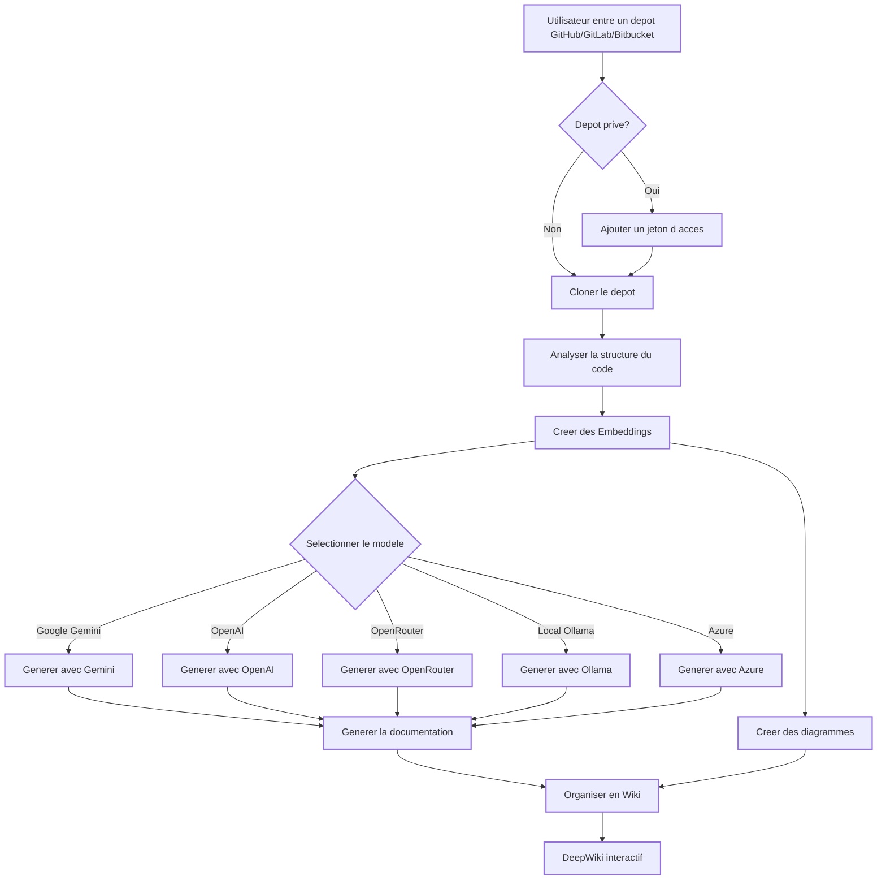

### ⚠️ Annonce : Recentrage sur AsyncReview
---

**MISE A JOUR IMPORTANTE** La maintenance de DeepWiki-Open se poursuit, mais le developpement actif principal se deplace vers **[AsyncReview](https://github.com/AsyncFuncAI/AsyncReview/)**. Merci pour votre soutien sur ce projet ; rejoignez-moi dans le nouveau depot pour l'effort principal de cette annee.

---
---

# DeepWiki-Open


**DeepWiki** est ma propre tentative d'implementation de DeepWiki, un outil qui cree automatiquement des wikis magnifiques et interactifs pour n'importe quel depot GitHub, GitLab ou Bitbucket ! Il suffit d'entrer un nom de depot, et DeepWiki :

1. Analyse la structure du code
2. Genere une documentation complete
3. Cree des diagrammes visuels pour expliquer le fonctionnement
4. Organise le tout dans un wiki facile a naviguer

[](https://buymeacoffee.com/sheing)
[](https://tip.md/sng-asyncfunc)
[](https://x.com/sashimikun_void)
[](https://discord.com/invite/VQMBGR8u5v)

[English](./README.md) | [简体中文](./README.zh.md) | [繁體中文](./README.zh-tw.md) | [日本語](./README.ja.md) | [Español](./README.es.md) | [한국어](./README.kr.md) | [Tiếng Việt](./README.vi.md) | [Português Brasileiro](./README.pt-br.md) | [Français](./README.fr.md) | [Русский](./README.ru.md)

## ✨ Fonctionnalites

- **Documentation instantanee** : Transforme un depot GitHub, GitLab ou Bitbucket en wiki en quelques secondes
- **Support des depots prives** : Acces securise avec jetons d'acces personnels
- **Analyse intelligente** : Comprehension de la structure et des relations du code via l'IA
- **Diagrammes elegants** : Diagrammes Mermaid automatiques pour visualiser l'architecture et les flux de donnees
- **Navigation facile** : Interface simple et intuitive
- **Fonction "Ask"** : Posez des questions a votre depot avec une IA alimentee par RAG
- **DeepResearch** : Processus de recherche multi-etapes pour explorer des sujets complexes
- **Multiples fournisseurs de modeles IA** : Prise en charge de Google Gemini, OpenAI, OpenRouter, et Ollama local
- **Embeddings flexibles** : Choix entre les embeddings OpenAI, Google AI ou Ollama local pour des performances optimales

### Fonctionnalites Entreprise

- **SSO GitLab** : Authentification unique basee sur OAuth2 avec les instances GitLab
- **Tableau de bord administrateur** : Indexation par lots, gestion des projets, supervision du systeme
- **Serveur MCP** : Point d'acces [Model Context Protocol](https://modelcontextprotocol.io/) authentifie par JWT — connectez Claude Code, Codex, ou tout client MCP pour interroger votre base de code
- **Gestion de produits** : Regroupez plusieurs depots en produits logiques pour une analyse inter-depots
- **Relations entre depots** : Visualisation automatique du graphe de dependances entre les depots
- **Ask Global** : Questions-reponses inter-depots sur l'ensemble des projets indexes
- **Informations structurees** : Modules, points d'acces API, modeles de donnees et pile technologique extraits par LLM pour chaque projet
- **Systeme de permissions** : Controle d'acces base sur GitLab avec cache en memoire (par projet 5 min, liste des projets 24h)

## 🚀 Demarrage rapide (super facile !)

### Option 1 : Avec Docker

```bash
# Cloner le depot
git clone https://github.com/AsyncFuncAI/deepwiki-open.git
cd deepwiki-open

# Creer un fichier .env avec vos cles API
echo "GOOGLE_API_KEY=votre_cle_google" > .env
echo "OPENAI_API_KEY=votre_cle_openai" >> .env
# Facultatif : Utiliser les embeddings Google AI au lieu d'OpenAI (recommande si vous utilisez les modeles Google)
echo "DEEPWIKI_EMBEDDER_TYPE=google" >> .env
# Facultatif : cle OpenRouter
echo "OPENROUTER_API_KEY=votre_cle_openrouter" >> .env
# Facultatif : hote personnalise Ollama (par defaut http://localhost:11434)
echo "OLLAMA_HOST=votre_hote_ollama" >> .env
# Facultatif : Azure OpenAI
echo "AZURE_OPENAI_API_KEY=votre_cle_azure" >> .env
echo "AZURE_OPENAI_ENDPOINT=votre_endpoint" >> .env
echo "AZURE_OPENAI_VERSION=version_api" >> .env

# Lancer avec Docker Compose
docker-compose up
```

Pour des instructions detaillees sur l'utilisation de DeepWiki avec Ollama et Docker, consultez [Ollama Instructions](Ollama-instruction.md).

> 💡 **Ou obtenir ces cles :**
> - Obtenez une cle API Google depuis [Google AI Studio](https://makersuite.google.com/app/apikey)
> - Obtenez une cle API OpenAI depuis [OpenAI Platform](https://platform.openai.com/api-keys)
> - Obtenez les identifiants Azure OpenAI depuis [Azure Portal](https://portal.azure.com/) – creez une ressource Azure OpenAI et recuperez la cle API, l'endpoint et la version de l'API

### Option 2 : Installation manuelle (Recommandee)

#### Etape 1 : Configurez vos cles API

Creez un fichier `.env` a la racine du projet avec ces cles :

```
GOOGLE_API_KEY=votre_cle_google
OPENAI_API_KEY=votre_cle_openai
# Optionnel : Utiliser les embeddings Google AI (recommande si vous utilisez les modeles Google)
DEEPWIKI_EMBEDDER_TYPE=google
# Optionnel : Ajoutez ceci pour utiliser des modeles OpenRouter
OPENROUTER_API_KEY=votre_cle_openrouter
# Optionnel : Ajoutez ceci pour utiliser des modeles Azure OpenAI
AZURE_OPENAI_API_KEY=votre_cle_azure_openai
AZURE_OPENAI_ENDPOINT=votre_endpoint_azure_openai
AZURE_OPENAI_VERSION=votre_version_azure_openai
# Optionnel : Ajouter un hote distant Ollama s'il n'est pas local. Defaut : http://localhost:11434
OLLAMA_HOST=votre_hote_ollama
```

#### Etape 2 : Demarrer le Backend

```bash
# Installer dependances Python
python -m pip install poetry==2.0.1 && poetry install -C api

# Demarrer le serveur API
python -m api.main
```

#### Etape 3 : Demarrer le Frontend

```bash
# Installer les dependances JavaScript
npm install
# ou
yarn install

# Demarrer le serveur web
npm run dev
# ou
yarn dev
```

#### Etape 4 : Utiliser DeepWiki !

1. Ouvrir [http://localhost:3000](http://localhost:3000) dans votre navigateur
2. Entrer l'adresse d'un depot GitHub, GitLab ou Bitbucket (comme `https://github.com/openai/codex`, `https://github.com/microsoft/autogen`, `https://gitlab.com/gitlab-org/gitlab`, ou `https://bitbucket.org/redradish/atlassian_app_versions`)
3. Pour les depots prives, cliquez sur "+ Ajouter un jeton d'acces" et entrez votre jeton d'acces personnel GitHub ou GitLab.
4. Cliquez sur "Generer le Wiki" et regardez la magie operer !

## 🔍 Comment ca marche

DeepWiki utilise l'IA pour :

1. Cloner et analyser le depot GitHub, GitLab ou Bitbucket (y compris les depots prives avec authentification par jeton d'acces)
2. Creer des embeddings du code pour une recuperation intelligente
3. Generer de la documentation avec une IA sensible au contexte (en utilisant les modeles Google Gemini, OpenAI, OpenRouter, Azure OpenAI ou Ollama local)
4. Creer des diagrammes visuels pour expliquer les relations du code
5. Organiser le tout dans un wiki structure
6. Permettre des questions-reponses intelligentes avec le depot grace a la fonctionnalite Ask
7. Fournir des capacites de recherche approfondie avec DeepResearch



## 🛠️ Structure du Projet

```
deepwiki/
├── api/                        # Serveur API Backend
│   ├── main.py                 # Point d entree (uvicorn)
│   ├── api.py                  # Application FastAPI, endpoints REST/WebSocket
│   ├── gitlab_auth.py          # SSO OAuth2 GitLab, JWT, jeton MCP
│   ├── gitlab_permission.py    # Verification des permissions depot + cache
│   ├── admin.py                # Routes API administrateur
│   ├── batch_indexer.py        # Indexation par lots en arriere-plan
│   ├── mcp_server.py           # Serveur MCP (authentifie par JWT)
│   ├── metadata_store.py       # Stockage JSON des metadonnees d index
│   ├── product_manager.py      # CRUD Produits
│   ├── repo_relations.py       # Analyse des dependances entre depots
│   ├── insight_extractor.py    # Extraction de connaissances structurees
│   ├── wiki_generator.py       # Logique principale de generation wiki
│   ├── rag.py                  # RAG mono-depot
│   ├── multi_rag.py            # RAG multi-depots
│   ├── data_pipeline.py        # Clonage de depots, embeddings
│   ├── config.py               # Chargeur de configuration, variables d env.
│   ├── prompts.py              # Templates de prompts LLM
│   ├── config/                 # Fichiers de configuration JSON
│   └── *_client.py             # Clients fournisseurs LLM
│
├── src/                        # Application Frontend Next.js
│   ├── app/
│   │   ├── page.tsx            # Accueil (connexion SSO, liste des projets)
│   │   ├── [owner]/[repo]/     # Visionneuse wiki
│   │   ├── admin/              # Tableau de bord administrateur
│   │   ├── admin/relations/    # Graphe de dependances des depots
│   │   ├── ask/                # Ask Global (Q&R inter-depots)
│   │   └── auth/callback/      # Callback OAuth
│   ├── components/             # Composants React
│   └── contexts/               # Contextes Auth, Language
│
├── public/                     # Ressources statiques
├── package.json                # Dependances JavaScript
└── .env                        # Variables d environnement (a creer)
```

## 🤖 Systeme de selection de modeles

DeepWiki implemente desormais un systeme de selection de modeles flexible, qui prend en charge plusieurs fournisseurs de LLM :

### Fournisseurs et modeles pris en charge

- **Google** : Par defaut `gemini-2.5-flash`, prend egalement en charge `gemini-2.5-flash-lite`, `gemini-2.5-pro`, etc.
- **OpenAI** : Par defaut `gpt-5-nano`, prend egalement en charge `gpt-5`, `4o`, etc.
- **OpenRouter** : Acces a plusieurs modeles via une API unifiee, notamment Claude, Llama, Mistral, etc.
- **Azure OpenAI** : Par defaut `gpt-4o`, prend egalement en charge `o4-mini`, etc.
- **Ollama** : Prise en charge des modeles open source executes localement, tels que `llama3`.

### Variables d'environnement

Chaque fournisseur requiert les variables d'environnement de cle API correspondantes :

```
# API Keys
GOOGLE_API_KEY=votre_cle_google        # Requis pour les modeles Google Gemini
OPENAI_API_KEY=votre_cle_openai        # Requis pour les modeles OpenAI
OPENROUTER_API_KEY=votre_cle_openrouter # Requis pour les modeles OpenRouter
AZURE_OPENAI_API_KEY=votre_cle_azure_openai  #Requis pour les modeles Azure OpenAI
AZURE_OPENAI_ENDPOINT=votre_endpoint_azure_openai  #Requis pour les modeles Azure OpenAI
AZURE_OPENAI_VERSION=votre_version_azure_openai  #Requis pour les modeles Azure OpenAI

# Configuration d un endpoint OpenAI API personnalise
OPENAI_BASE_URL=https://custom-api-endpoint.com/v1  # Optionnel, pour les endpoints API OpenAI personnalises

# Hote Ollama personnalise
OLLAMA_HOST=votre_hote_ollama # Optionnel, si Ollama n est pas local. defaut: http://localhost:11434

# Repertoire de configuration
DEEPWIKI_CONFIG_DIR=/chemin/vers/dossier/de/configuration  # Optionnel, pour personaliser le repertoire de stockage de la configuration
```

### Fichiers de Configuration

DeepWiki utilise des fichiers de configuration JSON pour gerer differents aspects du systeme :

1. **`generator.json`** : Configuration des modeles de generation de texte
   - Definit les fournisseurs de modeles disponibles (Google, OpenAI, OpenRouter, Azure, Ollama)
   - Specifie les modeles par defaut et disponibles pour chaque fournisseur
   - Contient des parametres specifiques aux modeles tels que la temperature et top_p

2. **`embedder.json`** : Configuration des modeles d'embedding et du traitement de texte
   - Definit les modeles d'embedding pour le stockage vectoriel
   - Contient la configuration du retriever pour RAG
   - Specifie les parametres du separateur de texte pour le chunking de documents

3. **`repo.json`** : Configuration de la gestion des depots
   - Contient des filtres de fichiers pour exclure certains fichiers et repertoires
   - Definit les limites de taille des depots et les regles de traitement

Par defaut, ces fichiers sont situes dans le repertoire `api/config/`. Vous pouvez personnaliser leur emplacement a l'aide de la variable d'environnement `DEEPWIKI_CONFIG_DIR`.

### Selection de Modeles Personnalises pour les Fournisseurs de Services

La fonctionnalite de selection de modeles personnalises est specialement concue pour les fournisseurs de services qui ont besoin de :

- Offrir plusieurs choix de modeles d'IA aux utilisateurs au sein de leur organisation
- S'adapter rapidement a l'evolution rapide du paysage des LLM sans modifications de code
- Prendre en charge des modeles specialises ou affines qui ne figurent pas dans la liste predefinie

Les fournisseurs de services peuvent implementer leurs offres de modeles en selectionnant parmi les options predefinies ou en entrant des identifiants de modeles personnalises dans l'interface utilisateur.

### Configuration de l'URL de base pour les canaux prives d'entreprise

La configuration `base_url` du client OpenAI est principalement concue pour les utilisateurs d'entreprise disposant de canaux API prives. Cette fonctionnalite :

- Permet la connexion a des points de terminaison API prives ou specifiques a l'entreprise.
- Permet aux organisations d'utiliser leurs propres services LLM auto-heberges ou deployes sur mesure.
- Prend en charge l'integration avec des services tiers compatibles avec l'API OpenAI.

**Bientot disponible** : Dans les prochaines mises a jour, DeepWiki prendra en charge un mode ou les utilisateurs devront fournir leurs propres cles API dans les requetes. Cela permettra aux entreprises clientes disposant de canaux prives d'utiliser leurs accords API existants sans partager leurs informations d'identification avec le deploiement DeepWiki.

## 🧩 Utilisation de modeles d'embedding compatibles avec OpenAI (par exemple, Alibaba Qwen)

Si vous souhaitez utiliser des modeles d'embedding compatibles avec l'API OpenAI (comme Alibaba Qwen), suivez ces etapes :

1. Remplacez le contenu de `api/config/embedder.json` par celui de `api/config/embedder_openai_compatible.json`.
2. Dans votre fichier `.env` a la racine du projet, definissez les variables d'environnement appropriees, par exemple :
   ```
   OPENAI_API_KEY=votre_cle_api
   OPENAI_BASE_URL=votre_endpoint_compatible_openai
   ```
3. Le programme substituera automatiquement les espaces reserves dans `embedder.json` avec les valeurs de vos variables d'environnement.

Cela vous permet de passer facilement a n'importe quel service d'embedding compatible avec OpenAI sans modifications de code.

## 🧠 Utilisation des Embeddings Google AI

DeepWiki prend desormais en charge les derniers modeles d'embedding de Google AI comme alternative aux embeddings OpenAI. Cela offre une meilleure integration si vous utilisez deja les modeles Google Gemini pour la generation de texte.

### Caracteristiques

- **Dernier modele** : Utilise le modele `text-embedding-004` de Google
- **Meme cle API** : Utilise votre `GOOGLE_API_KEY` existante (aucune configuration supplementaire requise)
- **Meilleure integration** : Optimise pour une utilisation avec les modeles de generation de texte Google Gemini
- **Specifique aux taches** : Prend en charge la similarite semantique, la recherche et la classification
- **Traitement par lots** : Traitement efficace de textes multiples

### Comment activer les Embeddings Google AI

**Option 1 : Variable d'environnement (Recommande)**

Definissez le type d'embedder dans votre fichier `.env` :

```bash
# Votre cle API Google existante
GOOGLE_API_KEY=votre_cle_google

# Activer les embeddings Google AI
DEEPWIKI_EMBEDDER_TYPE=google
```

**Option 2 : Environnement Docker**

```bash
docker run -p 8001:8001 -p 3000:3000 \
  -e GOOGLE_API_KEY=votre_cle_google \
  -e DEEPWIKI_EMBEDDER_TYPE=google \
  -v ~/.adalflow:/root/.adalflow \
  ghcr.io/asyncfuncai/deepwiki-open:latest
```

**Option 3 : Docker Compose**

Ajoutez a votre fichier `.env` :

```bash
GOOGLE_API_KEY=votre_cle_google
DEEPWIKI_EMBEDDER_TYPE=google
```

Puis lancez :

```bash
docker-compose up
```

### Types d'embedder disponibles

| Type | Description | Cle API requise | Notes |
|------|-------------|-----------------|-------|
| `openai` | Embeddings OpenAI (par defaut) | `OPENAI_API_KEY` | Utilise le modele `text-embedding-3-small` |
| `google` | Embeddings Google AI | `GOOGLE_API_KEY` | Utilise le modele `text-embedding-004` |
| `ollama` | Embeddings Ollama local | Aucune | Necessite une installation locale d'Ollama |

### Pourquoi utiliser les Embeddings Google AI ?

- **Coherence** : Si vous utilisez Google Gemini pour la generation de texte, les embeddings Google offrent une meilleure coherence semantique
- **Performance** : Le dernier modele d'embedding de Google offre d'excellentes performances pour les taches de recherche
- **Cout** : Tarification competitive par rapport a OpenAI
- **Aucune configuration supplementaire** : Utilise la meme cle API que vos modeles de generation de texte

### Changement d'embedder

Vous pouvez facilement basculer entre les differents fournisseurs d'embeddings :

```bash
# Utiliser les embeddings OpenAI (par defaut)
export DEEPWIKI_EMBEDDER_TYPE=openai

# Utiliser les embeddings Google AI
export DEEPWIKI_EMBEDDER_TYPE=google

# Utiliser les embeddings Ollama local
export DEEPWIKI_EMBEDDER_TYPE=ollama
```

**Remarque** : Lors du changement d'embedder, vous devrez peut-etre regenerer les embeddings de votre depot car les differents modeles produisent des espaces vectoriels differents.

### Journalisation (Logging)

DeepWiki utilise le module `logging` integre de Python pour la sortie de diagnostics. Vous pouvez configurer la verbosite et la destination du fichier journal via des variables d'environnement :

| Variable        | Description                                                               | Valeur par defaut             |
|-----------------|---------------------------------------------------------------------------|------------------------------|
| `LOG_LEVEL`     | Niveau de journalisation (DEBUG, INFO, WARNING, ERROR, CRITICAL).         | INFO                         |
| `LOG_FILE_PATH` | Chemin vers le fichier journal. Si defini, les journaux y seront ecrits.  | `api/logs/application.log`   |

Pour activer la journalisation de debogage et diriger les journaux vers un fichier personnalise :
```bash
export LOG_LEVEL=DEBUG
export LOG_FILE_PATH=./debug.log
python -m api.main
```
Ou avec Docker Compose :
```bash
LOG_LEVEL=DEBUG LOG_FILE_PATH=./debug.log docker-compose up
```

Lors de l'execution avec Docker Compose, le repertoire `api/logs` du conteneur est lie a `./api/logs` sur votre hote (voir la section `volumes` dans `docker-compose.yml`), ce qui garantit que les fichiers journaux persistent lors des redemarrages.

Vous pouvez egalement stocker ces parametres dans votre fichier `.env` :

```bash
LOG_LEVEL=DEBUG
LOG_FILE_PATH=./debug.log
```
Puis executez simplement :

```bash
docker-compose up
```

**Considerations de securite concernant le chemin des journaux :** Dans les environnements de production, assurez-vous que le repertoire `api/logs` et tout chemin de fichier journal personnalise sont securises avec des permissions de systeme de fichiers et des controles d'acces appropries. L'application s'assure que `LOG_FILE_PATH` se trouve dans le repertoire `api/logs` du projet afin d'empecher le parcours de chemin ou les ecritures non autorisees.

## 🛠️ Configuration Avancee

### Variables d'environnement

| Variable | Description | Requis | Note |
|---|---|---|---|
| **Fournisseurs LLM** ||||
| `GOOGLE_API_KEY` | Cle API Google Gemini | Non | Requis pour les modeles Gemini et les embeddings Google |
| `OPENAI_API_KEY` | Cle API OpenAI | Conditionnel | Requis si vous utilisez les embeddings ou modeles OpenAI |
| `OPENROUTER_API_KEY` | Cle API OpenRouter | Non | Requis pour les modeles OpenRouter |
| `AZURE_OPENAI_API_KEY` | Cle API Azure OpenAI | Non | Requis pour les modeles Azure OpenAI |
| `AZURE_OPENAI_ENDPOINT` | Point de terminaison Azure OpenAI | Non | Requis pour les modeles Azure OpenAI |
| `AZURE_OPENAI_VERSION` | Version Azure OpenAI | Non | Requis pour les modeles Azure OpenAI |
| `OLLAMA_HOST` | Hote Ollama (par defaut : http://localhost:11434) | Non | Requis pour un serveur Ollama externe |
| `DEEPWIKI_EMBEDDER_TYPE` | Embedder : `openai`, `google`, `ollama`, `bedrock` | Non | Par defaut : `openai` |
| **AWS Bedrock** ||||
| `AWS_ACCESS_KEY_ID` | Cle d acces AWS | Non | Requis pour Bedrock sans authentification par role |
| `AWS_SECRET_ACCESS_KEY` | Cle secrete AWS | Non | Requis pour Bedrock sans authentification par role |
| `AWS_REGION` | Region AWS (par defaut : `us-east-1`) | Non | |
| `AWS_ROLE_ARN` | ARN du role AWS a assumer | Non | Si defini, utilise STS AssumeRole |
| **GitLab Entreprise** ||||
| `GITLAB_URL` | URL de l instance GitLab | Non | Requis pour le SSO et les fonctionnalites entreprise |
| `GITLAB_CLIENT_ID` | ID de l application OAuth2 | Non | Requis pour le SSO GitLab |
| `GITLAB_CLIENT_SECRET` | Secret de l application OAuth2 | Non | Requis pour le SSO GitLab |
| `GITLAB_SERVICE_TOKEN` | Jeton de compte de service | Non | Requis pour l indexation par lots et l acces MCP aux depots |
| `JWT_SECRET_KEY` | Secret de signature JWT | Non | Requis lorsque le SSO est active |
| `ADMIN_USERNAMES` | Noms d utilisateur administrateur (separes par des virgules) | Non | Controle l acces au tableau de bord administrateur |
| `PERMISSION_CACHE_TTL` | TTL du cache de permissions en secondes | Non | Par defaut : 300 |
| `FRONTEND_ORIGIN` | URL du frontend pour les callbacks OAuth | Non | Par defaut : http://localhost:3000 |
| **Serveur** ||||
| `PORT` | Port du serveur API (par defaut : 8001) | Non | |
| `SERVER_BASE_URL` | URL du backend pour le proxy frontend | Non | Par defaut : http://localhost:8001 |
| `DEEPWIKI_CONFIG_DIR` | Repertoire de configuration personnalise | Non | Par defaut : `api/config/` |
| `DEEPWIKI_AUTH_MODE` | Activer le mode d authentification par code (`true`/`1`) | Non | Authentification simple pour les deploiements sans SSO |
| `DEEPWIKI_AUTH_CODE` | Code d authentification pour la generation wiki | Non | Utilise uniquement avec `DEEPWIKI_AUTH_MODE` |

**Exigences relatives aux cles API :**
- Si vous utilisez `DEEPWIKI_EMBEDDER_TYPE=openai` (par defaut) : `OPENAI_API_KEY` est requis
- Si vous utilisez `DEEPWIKI_EMBEDDER_TYPE=google` : `GOOGLE_API_KEY` est requis
- Si vous utilisez `DEEPWIKI_EMBEDDER_TYPE=ollama` : Aucune cle API requise (traitement local)
- Si vous utilisez `DEEPWIKI_EMBEDDER_TYPE=bedrock` : Les identifiants AWS (ou identifiants bases sur un role) sont requis

Les autres cles API ne sont requises que lors de la configuration et de l'utilisation de modeles des fournisseurs correspondants.

## Mode d'autorisation

DeepWiki peut etre configure pour fonctionner en mode d'autorisation, ou la generation de wiki necessite un code d'autorisation valide. Ceci est utile si vous souhaitez controler qui peut utiliser la fonctionnalite de generation.
Restreint l'initialisation du frontend et protege la suppression du cache, mais n'empeche pas completement la generation backend si les points de terminaison de l'API sont atteints directement.

Pour activer le mode d'autorisation, definissez les variables d'environnement suivantes :

- `DEEPWIKI_AUTH_MODE` : definissez cette variable sur `true` ou `1`. Une fois activee, l'interface affichera un champ de saisie pour le code d'autorisation.
- `DEEPWIKI_AUTH_CODE` : definissez cette variable sur le code secret souhaite. Restreint l'initialisation du frontend et protege la suppression du cache, mais n'empeche pas completement la generation backend si les points de terminaison de l'API sont atteints directement.

Si `DEEPWIKI_AUTH_MODE` n'est pas defini ou est defini sur `false` (ou toute autre valeur que `true`/`1`), la fonctionnalite d'autorisation sera desactivee et aucun code ne sera requis.

### Configuration Docker

Vous pouvez utiliser Docker pour executer DeepWiki :

#### Execution du conteneur

```bash
# Recuperer l image depuis GitHub Container Registry
docker pull ghcr.io/asyncfuncai/deepwiki-open:latest

# Executer le conteneur avec les variables d environnement
docker run -p 8001:8001 -p 3000:3000 \
  -e GOOGLE_API_KEY=votre_cle_google \
  -e OPENAI_API_KEY=votre_cle_openai \
  -e OPENROUTER_API_KEY=votre_cle_openrouter \
  -e OLLAMA_HOST=votre_hote_ollama \
  -e AZURE_OPENAI_API_KEY=votre_cle_azure_openai \
  -e AZURE_OPENAI_ENDPOINT=votre_endpoint_azure_openai \
  -e AZURE_OPENAI_VERSION=votre_version_azure_openai \

  -v ~/.adalflow:/root/.adalflow \
  ghcr.io/asyncfuncai/deepwiki-open:latest
```

Cette commande monte egalement `~/.adalflow` de votre hote vers `/root/.adalflow` dans le conteneur. Ce chemin est utilise pour stocker :
- Les depots clones (`~/.adalflow/repos/`)
- Leurs embeddings et index (`~/.adalflow/databases/`)
- Le contenu wiki genere mis en cache (`~/.adalflow/wikicache/`)

Cela garantit que vos donnees persistent meme si le conteneur est arrete ou supprime.

Vous pouvez egalement utiliser le fichier `docker-compose.yml` fourni :

```bash
# Modifiez d abord le fichier .env avec vos cles API
docker-compose up
```

(Le fichier `docker-compose.yml` est preconfigure pour monter `~/.adalflow` pour la persistance des donnees, de maniere similaire a la commande `docker run` ci-dessus.)

#### Utilisation d'un fichier .env avec Docker

Vous pouvez egalement monter un fichier `.env` dans le conteneur :

```bash
# Creer un fichier .env avec vos cles API
echo "GOOGLE_API_KEY=votre_cle_google" > .env
echo "OPENAI_API_KEY=votre_cle_openai" >> .env
echo "OPENROUTER_API_KEY=votre_cle_openrouter" >> .env
echo "AZURE_OPENAI_API_KEY=votre_cle_azure_openai" >> .env
echo "AZURE_OPENAI_ENDPOINT=votre_endpoint_azure_openai" >> .env
echo "AZURE_OPENAI_VERSION=votre_version_azure_openai"  >> .env
echo "OLLAMA_HOST=votre_hote_ollama" >> .env

# Executer le conteneur avec le fichier .env monte
docker run -p 8001:8001 -p 3000:3000 \
  -v $(pwd)/.env:/app/.env \
  -v ~/.adalflow:/root/.adalflow \
  ghcr.io/asyncfuncai/deepwiki-open:latest
```

Cette commande monte egalement `~/.adalflow` de votre hote vers `/root/.adalflow` dans le conteneur. Ce chemin est utilise pour stocker :
- Les depots clones (`~/.adalflow/repos/`)
- Leurs embeddings et index (`~/.adalflow/databases/`)
- Le contenu wiki genere mis en cache (`~/.adalflow/wikicache/`)

Cela garantit que vos donnees persistent meme si le conteneur est arrete ou supprime.

#### Construction de l'image Docker localement

Si vous souhaitez construire l'image Docker localement :

```bash
# Cloner le depot
git clone https://github.com/AsyncFuncAI/deepwiki-open.git
cd deepwiki-open

# Construire l image Docker
docker build -t deepwiki-open .

# Executer le conteneur
docker run -p 8001:8001 -p 3000:3000 \
  -e GOOGLE_API_KEY=votre_cle_google \
  -e OPENAI_API_KEY=votre_cle_openai \
  -e OPENROUTER_API_KEY=votre_cle_openrouter \
  -e AZURE_OPENAI_API_KEY=votre_cle_azure_openai \
  -e AZURE_OPENAI_ENDPOINT=votre_endpoint_azure_openai \
  -e AZURE_OPENAI_VERSION=votre_version_azure_openai \
  -e OLLAMA_HOST=votre_hote_ollama \
  deepwiki-open
```

#### Utilisation de certificats auto-signes dans Docker

Si vous etes dans un environnement qui utilise des certificats auto-signes, vous pouvez les inclure dans la construction de l'image Docker :

1. Creez un repertoire pour vos certificats (le repertoire par defaut est `certs` a la racine de votre projet)
2. Copiez vos fichiers de certificats `.crt` ou `.pem` dans ce repertoire
3. Construisez l'image Docker :

```bash
# Construire avec le repertoire de certificats par defaut (certs)
docker build .

# Ou construire avec un repertoire de certificats personnalise
docker build --build-arg CUSTOM_CERT_DIR=my-custom-certs .
```

### Details du serveur API

Le serveur API fournit :
- Clonage et indexation des depots
- RAG (Retrieval Augmented Generation - Generation augmentee par recuperation)
- Completion de chat en streaming

Pour plus de details, consultez le [README de l'API](./api/README.md).

## 🔌 Integration OpenRouter

DeepWiki prend desormais en charge [OpenRouter](https://openrouter.ai/) en tant que fournisseur de modeles, vous donnant acces a des centaines de modeles d'IA via une seule API :

- **Options de modeles multiples** : accedez aux modeles d'OpenAI, Anthropic, Google, Meta, Mistral, et plus encore
- **Configuration simple** : ajoutez simplement votre cle API OpenRouter et selectionnez le modele que vous souhaitez utiliser
- **Rentabilite** : choisissez des modeles qui correspondent a votre budget et a vos besoins en termes de performances
- **Commutation facile** : basculez entre differents modeles sans modifier votre code

### Comment utiliser OpenRouter avec DeepWiki

1. **Obtenez une cle API** : inscrivez-vous sur [OpenRouter](https://openrouter.ai/) et obtenez votre cle API
2. **Ajouter a l'environnement** : ajoutez `OPENROUTER_API_KEY=votre_cle` a votre fichier `.env`
3. **Activer dans l'interface utilisateur** : cochez l'option "Utiliser l'API OpenRouter" sur la page d'accueil
4. **Selectionnez le modele** : choisissez parmi les modeles populaires tels que GPT-4o, Claude 3.5 Sonnet, Gemini 2.0, et plus encore

OpenRouter est particulierement utile si vous souhaitez :

- Essayer differents modeles sans vous inscrire a plusieurs services
- Acceder a des modeles qui pourraient etre restreints dans votre region
- Comparer les performances entre differents fournisseurs de modeles
- Optimiser le rapport cout/performance en fonction de vos besoins

## 🤖 Fonctionnalites Ask & DeepResearch

### Fonctionnalite Ask

La fonctionnalite Ask vous permet de discuter avec votre depot en utilisant la generation augmentee par recuperation (RAG) :

- **Reponses sensibles au contexte** : obtenez des reponses precises basees sur le code reel de votre depot
- **Alimente par RAG** : le systeme recupere des extraits de code pertinents pour fournir des reponses fondees
- **Streaming en temps reel** : visualisez les reponses au fur et a mesure de leur generation pour une experience plus interactive
- **Historique des conversations** : le systeme conserve le contexte entre les questions pour des interactions plus coherentes

### Fonctionnalite DeepResearch

DeepResearch fait passer l'analyse de depot au niveau superieur avec un processus de recherche en plusieurs etapes :

- **Enquete approfondie** : explore en profondeur des sujets complexes grace a de multiples iterations de recherche
- **Processus structure** : suit un plan de recherche clair avec des mises a jour et une conclusion complete
- **Continuation automatique** : l'IA poursuit automatiquement la recherche jusqu'a ce qu'elle atteigne une conclusion (jusqu'a 5 iterations)
- **Etapes de la recherche** :
  1. **Plan de recherche** : decrit l'approche et les premieres conclusions
  2. **Mises a jour de la recherche** : s'appuie sur les iterations precedentes avec de nouvelles informations
  3. **Conclusion finale** : fournit une reponse complete basee sur toutes les iterations

Pour utiliser DeepResearch, activez simplement le commutateur "Deep Research" dans l'interface Ask avant de soumettre votre question.

## 🏢 Integration GitLab Entreprise

DeepWiki prend en charge un deploiement entreprise complet avec GitLab comme fournisseur d'identite et de depots.

### Configuration du SSO GitLab

1. Creez une application OAuth2 dans GitLab (Administration > Applications) :
   - **URI de redirection** : `http://votre-frontend:3000/auth/gitlab/callback`
   - **Scopes** : `read_user`, `read_api`
2. Definissez les variables d'environnement :
   ```bash
   GITLAB_URL=https://gitlab.example.com
   GITLAB_CLIENT_ID=votre_app_id
   GITLAB_CLIENT_SECRET=votre_app_secret
   JWT_SECRET_KEY=votre_secret_aleatoire
   FRONTEND_ORIGIN=http://votre-frontend:3000
   ADMIN_USERNAMES=admin_user1,admin_user2
   ```
3. Pour l'indexation par lots et l'acces au serveur MCP, creez un jeton de compte de service avec le scope `read_api` :
   ```bash
   GITLAB_SERVICE_TOKEN=glpat-xxxxxxxxxxxx
   ```

### Tableau de bord administrateur

Accessible a `/admin` pour les utilisateurs listes dans `ADMIN_USERNAMES` :
- **Projets indexes** : Consulter, reindexer ou supprimer les depots indexes
- **Indexation par lots** : Selectionner et indexer plusieurs projets GitLab a la fois
- **Produits** : Regrouper les depots en produits logiques pour une analyse inter-depots
- **Statistiques systeme** : Tailles des caches, etat de l'indexation, apercu de la configuration

### Relations entre depots

Disponible a `/admin/relations` :
- Detection automatique des dependances via analyse des imports assistee par LLM
- Graphe de dependances interactif (ReactFlow) avec modes de vue groupe/focus/complet
- Filtrage des aretes et visualisation des dependances inter-depots

## 🔌 Integration du Serveur MCP

DeepWiki expose un point d'acces [MCP](https://modelcontextprotocol.io/) authentifie a `/mcp`, permettant aux agents IA externes d'exploiter votre base de code indexee.

### Outils disponibles

| Outil | Description |
|-------|-------------|
| `list_products` | Lister tous les produits definis avec leurs depots |
| `get_product_overview` | Vue d'ensemble agregee de tous les depots d'un produit |
| `search_product_code` | Recherche semantique de code sur tous les depots d'un produit |
| `ask_product` | Poser des questions sur l'ensemble des depots d'un produit |
| `list_projects` | Lister tous les projets indexes avec leur statut |
| `get_wiki_summary` | Obtenir la structure du wiki et les titres des pages |
| `get_wiki_page` | Lire le contenu complet d'une page wiki |
| `search_code` | Recherche semantique de code dans un seul projet |
| `get_repo_relations` | Obtenir les relations de dependances |
| `ask_question` | Poser une question sur la base de code d'un projet |
| `get_project_insights` | Obtenir l'index de connaissances structurees |
| `extract_project_insights` | Extraire les informations via LLM |
| `get_product_insights` | Informations agregees sur l'ensemble d'un produit |

### Connecter Claude Code

1. Connectez-vous a DeepWiki via le SSO GitLab
2. Cliquez sur l'icone de cle dans la barre de navigation pour obtenir votre jeton MCP
3. Executez la commande generee :
   ```bash
   claude mcp add --transport http deepwiki http://votre-serveur:8001/mcp \
     --header "Authorization: Bearer <votre-jeton-mcp>"
   ```
4. Claude Code peut maintenant interroger votre base de code indexee

## 📱 Captures d'ecran


*L'interface principale de DeepWiki*


*Accedez aux depots prives avec des jetons d'acces personnels*


*DeepResearch effectue des recherches en plusieurs etapes pour des sujets complexes*

### Video de demonstration

[](https://youtu.be/zGANs8US8B4)

*Regardez DeepWiki en action !*

## ❓ Depannage

### Problemes de cle API

- **"Variables d'environnement manquantes"** : assurez-vous que votre fichier `.env` se trouve a la racine du projet et qu'il contient les cles API requises.
- **"Cle API non valide"** : verifiez que vous avez correctement copie la cle complete, sans espaces supplementaires.
- **"Erreur d'API OpenRouter"** : verifiez que votre cle API OpenRouter est valide et qu'elle dispose de credits suffisants.
- **"Erreur d'API Azure OpenAI"** : verifiez que vos informations d'identification Azure OpenAI (cle API, point de terminaison et version) sont correctes et que le service est correctement deploye.

### Problemes de connexion

- **"Impossible de se connecter au serveur API"** : assurez-vous que le serveur API est en cours d'execution sur le port 8001.
- **"Erreur CORS"** : l'API est configuree pour autoriser toutes les origines, mais si vous rencontrez des problemes, essayez d'executer le frontend et le backend sur la meme machine.

### Problemes de generation

- **"Erreur lors de la generation du wiki"** : pour les tres grands depots, essayez d'abord un depot plus petit.
- **"Format de depot non valide"** : assurez-vous que vous utilisez un format d'URL GitHub, GitLab ou Bitbucket valide.
- **"Impossible de recuperer la structure du depot"** : pour les depots prives, assurez-vous d'avoir saisi un jeton d'acces personnel valide avec les autorisations appropriees.
- **"Erreur de rendu du diagramme"** : l'application essaiera automatiquement de corriger les diagrammes casses.

### Solutions courantes

1. **Redemarrez les deux serveurs** : parfois, un simple redemarrage resout la plupart des problemes.
2. **Verifiez les journaux de la console** : ouvrez les outils de developpement du navigateur pour voir les erreurs JavaScript.
3. **Verifiez les journaux de l'API** : consultez le terminal ou l'API est en cours d'execution pour les erreurs Python.

## 🤝 Contribution

Les contributions sont les bienvenues ! N'hesitez pas a :
- Ouvrir des issues pour les bugs ou les demandes de fonctionnalites
- Soumettre des pull requests pour ameliorer le code
- Partager vos commentaires et vos idees

## 📄 Licence

Projet sous licence MIT – Voir le fichier [LICENSE](LICENSE).

## ⭐ Historique des stars

[](https://star-history.com/#AsyncFuncAI/deepwiki-open&Date)
