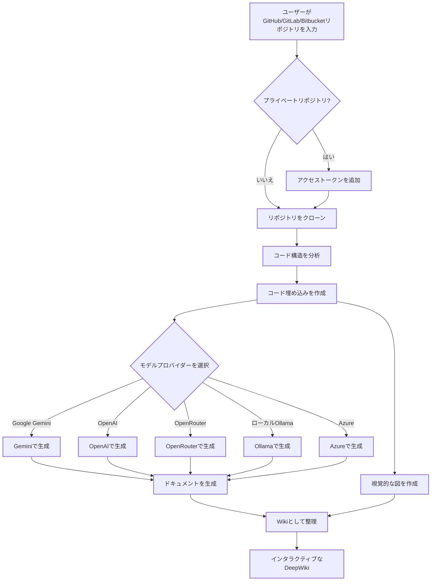

### ⚠️ お知らせ：AsyncReview への注力
---

**重要なアップデート** DeepWiki-Open のメンテナンスは継続しますが、主要な開発は **[AsyncReview](https://github.com/AsyncFuncAI/AsyncReview/)** に移行します。このプロジェクトへのご支援に感謝します。今年の主要な取り組みとして、新しいリポジトリにぜひご参加ください。

---
---

# DeepWiki-Open


**DeepWiki**は、GitHub、GitLab、または Bitbucket リポジトリのための美しくインタラクティブな Wiki を自動的に作成します！リポジトリ名を入力するだけで、DeepWiki は以下を行います：

1. コード構造を分析
2. 包括的なドキュメントを生成
3. すべての仕組みを説明する視覚的な図を作成
4. すべてを簡単に閲覧できる Wiki に整理

[](https://buymeacoffee.com/sheing)
[](https://tip.md/sng-asyncfunc)
[](https://x.com/sashimikun_void)
[](https://discord.com/invite/VQMBGR8u5v)

[English](./README.md) | [简体中文](./README.zh.md) | [繁體中文](./README.zh-tw.md) | [日本語](./README.ja.md) | [Español](./README.es.md) | [한국어](./README.kr.md) | [Tiếng Việt](./README.vi.md) | [Português Brasileiro](./README.pt-br.md) | [Français](./README.fr.md) | [Русский](./README.ru.md)

## ✨ 特徴

- **即時ドキュメント生成**: あらゆる GitHub、GitLab、または Bitbucket リポジトリを数秒で Wiki に変換
- **プライベートリポジトリ対応**: 個人アクセストークンを使用してプライベートリポジトリに安全にアクセス
- **スマート分析**: AI を活用したコード構造と関係の理解
- **美しい図表**: アーキテクチャとデータフローを視覚化する自動 Mermaid 図
- **簡単なナビゲーション**: Wiki を探索するためのシンプルで直感的なインターフェース
- **質問機能**: RAG 搭載 AI を使用してリポジトリとチャットし、正確な回答を得る
- **詳細調査**: 複雑なトピックを徹底的に調査する多段階研究プロセス
- **複数のモデルプロバイダー**: Google Gemini、OpenAI、OpenRouter、およびローカル Ollama モデルのサポート
- **柔軟な埋め込み**: 最適なパフォーマンスのために OpenAI、Google AI、またはローカル Ollama 埋め込みから選択

### エンタープライズ機能

- **GitLab SSO**: GitLab インスタンスとの OAuth2 ベースのシングルサインオン
- **管理ダッシュボード**: 一括インデックス、プロジェクト管理、システム監視
- **MCP サーバー**: JWT 認証付き [Model Context Protocol](https://modelcontextprotocol.io/) エンドポイント — Claude Code、Codex、その他の MCP クライアントを接続してコードベースに問い合わせ
- **プロダクト管理**: 複数のリポジトリを論理的なプロダクトにグループ化し、リポジトリ横断分析を実現
- **リポジトリ関連図**: リポジトリ間の依存関係グラフの自動可視化
- **グローバル質問**: インデックス済みの全プロジェクトを横断する Q&A
- **構造化インサイト**: プロジェクトごとに LLM で抽出されたモジュール、API エンドポイント、データモデル、技術スタック
- **権限システム**: インメモリキャッシュ付き GitLab ベースのアクセス制御（プロジェクト単位 5 分、プロジェクト一覧 24 時間）

## 🚀 クイックスタート（超簡単！）

### オプション 1: Docker を使用

```bash
# リポジトリをクローン
git clone https://github.com/AsyncFuncAI/deepwiki-open.git
cd deepwiki-open

# APIキーを含む.envファイルを作成
echo "GOOGLE_API_KEY=your_google_api_key" > .env
echo "OPENAI_API_KEY=your_openai_api_key" >> .env
# オプション: OpenAIの代わりにGoogle AIの埋め込みを使用（Googleモデル使用時に推奨）
echo "DEEPWIKI_EMBEDDER_TYPE=google" >> .env
# オプション: OpenRouterモデルを使用する場合はOpenRouter APIキーを追加
echo "OPENROUTER_API_KEY=your_openrouter_api_key" >> .env
# オプション: Ollamaがローカルでない場合はホストを追加。デフォルト: http://localhost:11434
echo "OLLAMA_HOST=your_ollama_host" >> .env
# オプション: Azure OpenAIモデルを使用する場合はAzure APIキー、エンドポイント、バージョンを追加
echo "AZURE_OPENAI_API_KEY=your_azure_openai_api_key" >> .env
echo "AZURE_OPENAI_ENDPOINT=your_azure_openai_endpoint" >> .env
echo "AZURE_OPENAI_VERSION=your_azure_openai_version" >> .env
# Docker Composeで実行
docker-compose up
```

Ollama と Docker を使用した DeepWiki の詳細な手順については、[Ollama の手順](Ollama-instruction.md)を参照してください。

> 💡 **これらのキーの入手先:**
> - Google API キーは[Google AI Studio](https://makersuite.google.com/app/apikey)から取得
> - OpenAI API キーは[OpenAI Platform](https://platform.openai.com/api-keys)から取得
> - Azure OpenAI の認証情報は [Azure Portal](https://portal.azure.com/) から取得 — Azure OpenAI リソースを作成し、API キー、エンドポイント、API バージョンを取得

### オプション 2: 手動セットアップ（推奨）

#### ステップ 1: API キーの設定

プロジェクトのルートに`.env`ファイルを作成し、以下のキーを追加します：

```
GOOGLE_API_KEY=your_google_api_key
OPENAI_API_KEY=your_openai_api_key
# オプション: Google AIの埋め込みを使用（Googleモデル使用時に推奨）
DEEPWIKI_EMBEDDER_TYPE=google
# オプション: OpenRouterモデルを使用する場合は追加
OPENROUTER_API_KEY=your_openrouter_api_key
# オプション: Azure OpenAIモデルを使用する場合は追加
AZURE_OPENAI_API_KEY=your_azure_openai_api_key
AZURE_OPENAI_ENDPOINT=your_azure_openai_endpoint
AZURE_OPENAI_VERSION=your_azure_openai_version
# オプション: Ollamaがローカルでない場合はホストを追加。デフォルト: http://localhost:11434
OLLAMA_HOST=your_ollama_host
```

#### ステップ 2: バックエンドの起動

```bash
# Pythonの依存関係をインストール
python -m pip install poetry==2.0.1 && poetry install -C api

# APIサーバーを起動
python -m api.main
```

#### ステップ 3: フロントエンドの起動

```bash
# JavaScript依存関係をインストール
npm install
# または
yarn install

# Webアプリを起動
npm run dev
# または
yarn dev
```

#### ステップ 4: DeepWiki を使用！

1. ブラウザで[http://localhost:3000](http://localhost:3000)を開く
2. GitHub、GitLab、または Bitbucket リポジトリを入力（例：`https://github.com/openai/codex`、`https://github.com/microsoft/autogen`、`https://gitlab.com/gitlab-org/gitlab`、または`https://bitbucket.org/redradish/atlassian_app_versions`）
3. プライベートリポジトリの場合は、「+ アクセストークンを追加」をクリックして GitHub または GitLab の個人アクセストークンを入力
4. 「Wiki を生成」をクリックして、魔法が起こるのを見守りましょう！

## 🔍 仕組み

DeepWiki は AI を使用して：

1. GitHub、GitLab、または Bitbucket リポジトリをクローンして分析（トークン認証によるプライベートリポジトリを含む）
2. スマート検索のためのコードの埋め込みを作成
3. コンテキスト対応 AI でドキュメントを生成（Google Gemini、OpenAI、OpenRouter、Azure OpenAI、またはローカル Ollama モデルを使用）
4. コードの関係を説明する視覚的な図を作成
5. すべてを構造化された Wiki に整理
6. 質問機能を通じてリポジトリとのインテリジェントな Q&A を可能に
7. 詳細調査機能で深い研究能力を提供



## 🛠️ プロジェクト構造

```
deepwiki/
├── api/                        # バックエンドAPIサーバー
│   ├── main.py                 # エントリーポイント（uvicorn）
│   ├── api.py                  # FastAPIアプリ、REST/WebSocketエンドポイント
│   ├── gitlab_auth.py          # GitLab OAuth2 SSO、JWT、MCPトークン
│   ├── gitlab_permission.py    # リポジトリ権限チェック + キャッシュ
│   ├── admin.py                # 管理APIルート
│   ├── batch_indexer.py        # バックグラウンド一括インデックス
│   ├── mcp_server.py           # MCPサーバー（JWT認証付き）
│   ├── metadata_store.py       # インデックスメタデータJSONストア
│   ├── product_manager.py      # プロダクトCRUD
│   ├── repo_relations.py       # リポジトリ依存関係分析
│   ├── insight_extractor.py    # 構造化知識抽出
│   ├── wiki_generator.py       # コアWiki生成ロジック
│   ├── rag.py                  # 単一リポジトリRAG
│   ├── multi_rag.py            # マルチリポジトリRAG
│   ├── data_pipeline.py        # リポジトリクローン、埋め込み
│   ├── config.py               # 設定ローダー、環境変数
│   ├── prompts.py              # LLMプロンプトテンプレート
│   ├── config/                 # JSON設定ファイル
│   └── *_client.py             # LLMプロバイダークライアント
│
├── src/                        # フロントエンドNext.jsアプリ
│   ├── app/
│   │   ├── page.tsx            # ホーム（SSOログイン、プロジェクト一覧）
│   │   ├── [owner]/[repo]/     # Wikiビューア
│   │   ├── admin/              # 管理ダッシュボード
│   │   ├── admin/relations/    # リポジトリ依存関係グラフ
│   │   ├── ask/                # グローバル質問（リポジトリ横断Q&A）
│   │   └── auth/callback/      # OAuthコールバック
│   ├── components/             # Reactコンポーネント
│   └── contexts/               # Auth、Languageコンテキスト
│
├── public/                     # 静的アセット
├── package.json                # JavaScript依存関係
└── .env                        # 環境変数（作成する必要あり）
```

## 🤖 プロバイダーベースのモデル選択システム

DeepWikiでは、複数のLLMプロバイダーをサポートする柔軟なプロバイダーベースのモデル選択システムを実装しています：

### サポートされているプロバイダーとモデル

- **Google**: デフォルトは `gemini-2.5-flash`、また `gemini-2.5-flash-lite`、`gemini-2.5-pro` などもサポート
- **OpenAI**: デフォルトは `gpt-5-nano`、また `gpt-5`、`4o` などもサポート
- **OpenRouter**: Claude、Llama、Mistralなど、統一APIを通じて複数のモデルにアクセス
- **Azure OpenAI**: デフォルトは `gpt-4o`、また `o4-mini` などもサポート
- **Ollama**: `llama3` などのローカルで実行するオープンソースモデルをサポート

### 環境変数

各プロバイダーには、対応するAPI鍵の環境変数が必要です：

```
# API鍵
GOOGLE_API_KEY=your_google_api_key        # Google Geminiモデルに必要
OPENAI_API_KEY=your_openai_api_key        # OpenAIモデルに必要
OPENROUTER_API_KEY=your_openrouter_api_key # OpenRouterモデルに必要
AZURE_OPENAI_API_KEY=your_azure_openai_api_key  # Azure OpenAIモデルに必要
AZURE_OPENAI_ENDPOINT=your_azure_openai_endpoint  # Azure OpenAIモデルに必要
AZURE_OPENAI_VERSION=your_azure_openai_version  # Azure OpenAIモデルに必要

# OpenAI APIベースURL設定
OPENAI_BASE_URL=https://custom-api-endpoint.com/v1  # オプション、カスタムOpenAI APIエンドポイント用

# Ollamaホスト
OLLAMA_HOST=your_ollama_host # オプション、Ollamaがローカルでない場合。デフォルト: http://localhost:11434

# 設定ディレクトリ
DEEPWIKI_CONFIG_DIR=/path/to/custom/config/dir  # オプション、カスタム設定ファイルの場所用
```

### 設定ファイル

DeepWikiはシステムの様々な側面を管理するためにJSON設定ファイルを使用しています：

1. **`generator.json`**: テキスト生成モデルの設定
   - 利用可能なモデルプロバイダー（Google、OpenAI、OpenRouter、Azure、Ollama）を定義
   - 各プロバイダーのデフォルトおよび利用可能なモデルを指定
   - temperatureやtop_pなどのモデル固有のパラメータを含む

2. **`embedder.json`**: 埋め込みモデルとテキスト処理の設定
   - ベクトルストレージ用の埋め込みモデルを定義
   - RAG用の検索設定を含む
   - ドキュメントチャンク分割のためのテキスト分割設定を指定

3. **`repo.json`**: リポジトリ処理の設定
   - 特定のファイルやディレクトリを除外するファイルフィルターを含む
   - リポジトリサイズ制限と処理ルールを定義

デフォルトでは、これらのファイルは`api/config/`ディレクトリにあります。`DEEPWIKI_CONFIG_DIR`環境変数を使用して、その場所をカスタマイズできます。

### サービスプロバイダー向けのカスタムモデル選択

カスタムモデル選択機能は、以下を必要とするサービスプロバイダー向けに設計されています：

- 組織内のユーザーに複数のAIモデルの選択肢を提供
- コード変更なしで急速に進化するLLM環境に迅速に適応
- 事前定義リストにない専門的またはファインチューニングされたモデルをサポート

サービスプロバイダーは、事前定義されたオプションから選択するか、フロントエンドインターフェースでカスタムモデル識別子を入力することで、モデル提供を実装できます。

### エンタープライズプライベートチャネル向けのベースURL設定

OpenAIクライアントのbase_url設定は、主にプライベートAPIチャネルを持つエンタープライズユーザー向けに設計されています。この機能は：

- プライベートまたは企業固有のAPIエンドポイントへの接続を可能に
- 組織が自己ホスト型または独自にデプロイされたLLMサービスを使用可能に
- サードパーティのOpenAI API互換サービスとの統合をサポート

**近日公開**: 将来のアップデートでは、ユーザーがリクエストで自分のAPI鍵を提供する必要があるモードをDeepWikiがサポートする予定です。これにより、プライベートチャネルを持つエンタープライズ顧客は、DeepWikiデプロイメントと認証情報を共有することなく、既存のAPI設定を使用できるようになります。

## 🧩 OpenAI 互換埋め込みモデルの使用（例：Alibaba Qwen）

OpenAI API と互換性のある埋め込みモデル（Alibaba Qwen など）を使用する場合は、以下の手順に従ってください：

1. `api/config/embedder.json` の内容を `api/config/embedder_openai_compatible.json` の内容で置き換えます。
2. プロジェクトルートの `.env` ファイルで、関連する環境変数を設定します。例：
   ```
   OPENAI_API_KEY=your_api_key
   OPENAI_BASE_URL=your_openai_compatible_endpoint
   ```
3. プログラムは embedder.json のプレースホルダーを環境変数の値で自動的に置き換えます。

これにより、コード変更なしで任意の OpenAI 互換埋め込みサービスにシームレスに切り替えることができます。

## 🧠 Google AI 埋め込みの使用

DeepWiki は OpenAI 埋め込みの代替として Google AI の最新埋め込みモデルをサポートしています。Google Gemini モデルをテキスト生成に使用している場合、より良い統合を提供します。

### 特徴

- **最新モデル**: Google の `text-embedding-004` モデルを使用
- **同じ API キー**: 既存の `GOOGLE_API_KEY` を使用（追加のセットアップ不要）
- **より良い統合**: Google Gemini テキスト生成モデルとの使用に最適化
- **タスク固有**: セマンティック類似性、検索、分類タスクをサポート
- **バッチ処理**: 複数テキストの効率的な処理

### Google AI 埋め込みを有効にする方法

**オプション 1: 環境変数（推奨）**

`.env` ファイルで埋め込みタイプを設定します：

```bash
# 既存の Google API キー
GOOGLE_API_KEY=your_google_api_key

# Google AI 埋め込みを有効化
DEEPWIKI_EMBEDDER_TYPE=google
```

**オプション 2: Docker 環境**

```bash
docker run -p 8001:8001 -p 3000:3000 \
  -e GOOGLE_API_KEY=your_google_api_key \
  -e DEEPWIKI_EMBEDDER_TYPE=google \
  -v ~/.adalflow:/root/.adalflow \
  ghcr.io/asyncfuncai/deepwiki-open:latest
```

**オプション 3: Docker Compose**

`.env` ファイルに追加：

```bash
GOOGLE_API_KEY=your_google_api_key
DEEPWIKI_EMBEDDER_TYPE=google
```

その後実行：

```bash
docker-compose up
```

### 利用可能な埋め込みタイプ

| タイプ | 説明 | 必要な API キー | 備考 |
|------|-------------|------------------|-------|
| `openai` | OpenAI 埋め込み（デフォルト） | `OPENAI_API_KEY` | `text-embedding-3-small` モデルを使用 |
| `google` | Google AI 埋め込み | `GOOGLE_API_KEY` | `text-embedding-004` モデルを使用 |
| `ollama` | ローカル Ollama 埋め込み | なし | ローカル Ollama のインストールが必要 |

### Google AI 埋め込みを使用する理由

- **一貫性**: テキスト生成に Google Gemini を使用している場合、Google 埋め込みを使用することでセマンティックの一貫性が向上
- **パフォーマンス**: Google の最新埋め込みモデルは検索タスクに優れたパフォーマンスを提供
- **コスト**: OpenAI と比較して競争力のある価格設定
- **追加セットアップ不要**: テキスト生成モデルと同じ API キーを使用

### 埋め込みの切り替え

異なる埋め込みプロバイダー間を簡単に切り替えることができます：

```bash
# OpenAI 埋め込みを使用（デフォルト）
export DEEPWIKI_EMBEDDER_TYPE=openai

# Google AI 埋め込みを使用
export DEEPWIKI_EMBEDDER_TYPE=google

# ローカル Ollama 埋め込みを使用
export DEEPWIKI_EMBEDDER_TYPE=ollama
```

**注意**: 埋め込みを切り替える場合、異なるモデルは異なるベクトル空間を生成するため、リポジトリの埋め込みを再生成する必要がある場合があります。

### ログ

DeepWiki は診断出力に Python の組み込み `logging` モジュールを使用します。環境変数で詳細度とログファイルの出力先を設定できます：

| 変数 | 説明 | デフォルト |
|------|------|---------|
| `LOG_LEVEL` | ログレベル（DEBUG、INFO、WARNING、ERROR、CRITICAL） | INFO |
| `LOG_FILE_PATH` | ログファイルのパス。設定するとこのファイルにログが書き込まれます。 | `api/logs/application.log` |

デバッグログを有効にしてカスタムファイルにログを出力するには：
```bash
export LOG_LEVEL=DEBUG
export LOG_FILE_PATH=./debug.log
python -m api.main
```
Docker Compose の場合：
```bash
LOG_LEVEL=DEBUG LOG_FILE_PATH=./debug.log docker-compose up
```

Docker Compose で実行する場合、コンテナの `api/logs` ディレクトリはホストの `./api/logs` にバインドマウントされ（`docker-compose.yml` の `volumes` セクションを参照）、再起動してもログファイルが永続化されます。

また、これらの設定を `.env` ファイルに保存することもできます：

```bash
LOG_LEVEL=DEBUG
LOG_FILE_PATH=./debug.log
```
その後実行：

```bash
docker-compose up
```

**ログパスのセキュリティに関する注意:** 本番環境では、`api/logs` ディレクトリおよびカスタムログファイルパスに適切なファイルシステム権限とアクセス制御を設定してください。アプリケーションは `LOG_FILE_PATH` がプロジェクトの `api/logs` ディレクトリ内に存在することを強制し、パストラバーサルや不正な書き込みを防止します。

## 🛠️ 高度な設定

### 環境変数

| 変数 | 説明 | 必須 | 注意 |
|---|---|---|---|
| **LLM プロバイダー** ||||
| `GOOGLE_API_KEY` | Google Gemini API キー | いいえ | Gemini モデルと Google 埋め込みに必要 |
| `OPENAI_API_KEY` | OpenAI API キー | 条件付き | OpenAI 埋め込みまたはモデル使用時に必要 |
| `OPENROUTER_API_KEY` | OpenRouter API キー | いいえ | OpenRouter モデルに必要 |
| `AZURE_OPENAI_API_KEY` | Azure OpenAI API キー | いいえ | Azure OpenAI モデルに必要 |
| `AZURE_OPENAI_ENDPOINT` | Azure OpenAI エンドポイント | いいえ | Azure OpenAI モデルに必要 |
| `AZURE_OPENAI_VERSION` | Azure OpenAI バージョン | いいえ | Azure OpenAI モデルに必要 |
| `OLLAMA_HOST` | Ollama ホスト（デフォルト: http://localhost:11434） | いいえ | 外部 Ollama サーバーに必要 |
| `DEEPWIKI_EMBEDDER_TYPE` | 埋め込み: `openai`、`google`、`ollama`、`bedrock` | いいえ | デフォルト: `openai` |
| **AWS Bedrock** ||||
| `AWS_ACCESS_KEY_ID` | AWS アクセスキー | いいえ | ロールベース認証なしの Bedrock に必要 |
| `AWS_SECRET_ACCESS_KEY` | AWS シークレットキー | いいえ | ロールベース認証なしの Bedrock に必要 |
| `AWS_REGION` | AWS リージョン（デフォルト: `us-east-1`） | いいえ | |
| `AWS_ROLE_ARN` | 引き受ける AWS ロール ARN | いいえ | 設定時、STS AssumeRole を使用 |
| **GitLab エンタープライズ** ||||
| `GITLAB_URL` | GitLab インスタンス URL | いいえ | SSO とエンタープライズ機能に必要 |
| `GITLAB_CLIENT_ID` | OAuth2 アプリケーション ID | いいえ | GitLab SSO に必要 |
| `GITLAB_CLIENT_SECRET` | OAuth2 アプリケーションシークレット | いいえ | GitLab SSO に必要 |
| `GITLAB_SERVICE_TOKEN` | サービスアカウントトークン | いいえ | 一括インデックスと MCP リポジトリアクセスに必要 |
| `JWT_SECRET_KEY` | JWT 署名シークレット | いいえ | SSO 有効時に必要 |
| `ADMIN_USERNAMES` | カンマ区切りの管理者ユーザー名 | いいえ | 管理ダッシュボードへのアクセスを制御 |
| `PERMISSION_CACHE_TTL` | 権限キャッシュ TTL（秒） | いいえ | デフォルト: 300 |
| `FRONTEND_ORIGIN` | OAuth コールバック用フロントエンド URL | いいえ | デフォルト: http://localhost:3000 |
| **サーバー** ||||
| `PORT` | API サーバーポート（デフォルト: 8001） | いいえ | |
| `SERVER_BASE_URL` | フロントエンドプロキシ用バックエンド URL | いいえ | デフォルト: http://localhost:8001 |
| `DEEPWIKI_CONFIG_DIR` | カスタム設定ディレクトリ | いいえ | デフォルト: `api/config/` |
| `DEEPWIKI_AUTH_MODE` | 認証コードモードを有効化（`true`/`1`） | いいえ | SSO 以外のデプロイ用の簡易認証 |
| `DEEPWIKI_AUTH_CODE` | Wiki 生成用の認証コード | いいえ | `DEEPWIKI_AUTH_MODE` と併用 |

**API キーの要件:**
- `DEEPWIKI_EMBEDDER_TYPE=openai`（デフォルト）使用時: `OPENAI_API_KEY` が必要
- `DEEPWIKI_EMBEDDER_TYPE=google` 使用時: `GOOGLE_API_KEY` が必要
- `DEEPWIKI_EMBEDDER_TYPE=ollama` 使用時: API キー不要（ローカル処理）
- `DEEPWIKI_EMBEDDER_TYPE=bedrock` 使用時: AWS 認証情報（またはロールベース認証情報）が必要

その他の API キーは、対応するプロバイダーのモデルを設定・使用する場合にのみ必要です。

## 認証モード

DeepWiki は認証モードで実行するように設定できます。Wiki 生成に有効な認証コードが必要になります。生成機能を使用できるユーザーを制御したい場合に便利です。
フロントエンドからの開始を制限しキャッシュ削除を保護しますが、API エンドポイントに直接アクセスされた場合はバックエンド生成を完全には防止しません。

認証モードを有効にするには、以下の環境変数を設定します：

- `DEEPWIKI_AUTH_MODE`: `true` または `1` に設定します。有効にすると、フロントエンドに認証コードの入力フィールドが表示されます。
- `DEEPWIKI_AUTH_CODE`: 目的のシークレットコードに設定します。フロントエンドからの開始を制限しキャッシュ削除を保護しますが、API エンドポイントに直接アクセスされた場合はバックエンド生成を完全には防止しません。

`DEEPWIKI_AUTH_MODE` が設定されていないか、`false`（または `true`/`1` 以外の値）に設定されている場合、認証機能は無効になり、コードは不要です。

### Docker セットアップ

Docker を使用して DeepWiki を実行できます：

#### コンテナの実行

```bash
# GitHub Container Registryからイメージをプル
docker pull ghcr.io/asyncfuncai/deepwiki-open:latest

# 環境変数を設定してコンテナを実行
docker run -p 8001:8001 -p 3000:3000 \
  -e GOOGLE_API_KEY=your_google_api_key \
  -e OPENAI_API_KEY=your_openai_api_key \
  -e OPENROUTER_API_KEY=your_openrouter_api_key \
  -e OLLAMA_HOST=your_ollama_host \
  -e AZURE_OPENAI_API_KEY=your_azure_openai_api_key \
  -e AZURE_OPENAI_ENDPOINT=your_azure_openai_endpoint \
  -e AZURE_OPENAI_VERSION=your_azure_openai_version \

  -v ~/.adalflow:/root/.adalflow \
  ghcr.io/asyncfuncai/deepwiki-open:latest
```

このコマンドは、ホスト上の `~/.adalflow` をコンテナ内の `/root/.adalflow` にマウントします。このパスは以下のものを保存するために使用されます：
- クローンされたリポジトリ（`~/.adalflow/repos/`）
- それらの埋め込みとインデックス（`~/.adalflow/databases/`）
- 生成された Wiki のキャッシュ（`~/.adalflow/wikicache/`）

これにより、コンテナが停止または削除されてもデータが永続化されます。

または、提供されている `docker-compose.yml` ファイルを使用します：

```bash
# まず.envファイルをAPIキーで編集
docker-compose up
```

（`docker-compose.yml` ファイルは、上記の `docker run` コマンドと同様に、データ永続化のために `~/.adalflow` をマウントするように事前設定されています。）

#### Docker で.env ファイルを使用する

.env ファイルをコンテナにマウントすることもできます：

```bash
# APIキーを含む.envファイルを作成
echo "GOOGLE_API_KEY=your_google_api_key" > .env
echo "OPENAI_API_KEY=your_openai_api_key" >> .env
echo "OPENROUTER_API_KEY=your_openrouter_api_key" >> .env
echo "AZURE_OPENAI_API_KEY=your_azure_openai_api_key" >> .env
echo "AZURE_OPENAI_ENDPOINT=your_azure_openai_endpoint" >> .env
echo "AZURE_OPENAI_VERSION=your_azure_openai_version"  >>.env
echo "OLLAMA_HOST=your_ollama_host" >> .env

# .envファイルをマウントしてコンテナを実行
docker run -p 8001:8001 -p 3000:3000 \
  -v $(pwd)/.env:/app/.env \
  -v ~/.adalflow:/root/.adalflow \
  ghcr.io/asyncfuncai/deepwiki-open:latest
```

このコマンドは、ホスト上の `~/.adalflow` をコンテナ内の `/root/.adalflow` にマウントします。このパスは以下のものを保存するために使用されます：
- クローンされたリポジトリ（`~/.adalflow/repos/`）
- それらの埋め込みとインデックス（`~/.adalflow/databases/`）
- 生成された Wiki のキャッシュ（`~/.adalflow/wikicache/`）

これにより、コンテナが停止または削除されてもデータが永続化されます。

#### Docker イメージをローカルでビルドする

Docker イメージをローカルでビルドしたい場合：

```bash
# リポジトリをクローン
git clone https://github.com/AsyncFuncAI/deepwiki-open.git
cd deepwiki-open

# Dockerイメージをビルド
docker build -t deepwiki-open .

# コンテナを実行
docker run -p 8001:8001 -p 3000:3000 \
  -e GOOGLE_API_KEY=your_google_api_key \
  -e OPENAI_API_KEY=your_openai_api_key \
  -e OPENROUTER_API_KEY=your_openrouter_api_key \
  -e AZURE_OPENAI_API_KEY=your_azure_openai_api_key \
  -e AZURE_OPENAI_ENDPOINT=your_azure_openai_endpoint \
  -e AZURE_OPENAI_VERSION=your_azure_openai_version \
  -e OLLAMA_HOST=your_ollama_host \
  deepwiki-open
```

#### Docker で自己署名証明書を使用する

自己署名証明書を使用する環境の場合、Docker ビルドに含めることができます：

1. 証明書用のディレクトリを作成（デフォルトはプロジェクトルートの `certs`）
2. `.crt` または `.pem` 証明書ファイルをこのディレクトリにコピー
3. Docker イメージをビルド：

```bash
# デフォルトの証明書ディレクトリ（certs）でビルド
docker build .

# またはカスタム証明書ディレクトリでビルド
docker build --build-arg CUSTOM_CERT_DIR=my-custom-certs .
```

### API サーバー詳細

API サーバーは以下を提供します：
- リポジトリのクローンとインデックス作成
- RAG（Retrieval Augmented Generation：検索拡張生成）
- ストリーミングチャット補完

詳細については、[API README](./api/README.md) を参照してください。

## 🔌 OpenRouter 連携

DeepWiki は、モデルプロバイダーとして [OpenRouter](https://openrouter.ai/) をサポートしており、単一の API を通じて数百の AI モデルにアクセスできます：

- **複数のモデルオプション**: OpenAI、Anthropic、Google、Meta、Mistralなど、様々なモデルにアクセス
- **簡単な設定**: OpenRouter API キーを追加し、使用したいモデルを選択するだけ
- **コスト効率**: 予算とパフォーマンスのニーズに合ったモデルを選択
- **簡単な切り替え**: コードを変更することなく、異なるモデル間を切り替え可能

### DeepWiki で OpenRouter を使用する方法

1. **API キーを取得**: [OpenRouter](https://openrouter.ai/) でサインアップし、API キーを取得します
2. **環境に追加**: `.env` ファイルに `OPENROUTER_API_KEY=your_key` を追加します
3. **UI で有効化**: ホームページの「OpenRouter API を使用」オプションをチェックします
4. **モデルを選択**: GPT-4o、Claude 3.5 Sonnet、Gemini 2.0 などの人気モデルから選択します

OpenRouter は特に以下のような場合に便利です：
- 複数のサービスにサインアップせずに異なるモデルを試したい
- お住まいの地域で制限されている可能性のあるモデルにアクセスしたい
- 異なるモデルプロバイダー間でパフォーマンスを比較したい
- ニーズに基づいてコストとパフォーマンスを最適化したい

## 🤖 質問と詳細調査機能

### 質問機能

質問機能を使用すると、検索拡張生成（RAG）を使用してリポジトリとチャットできます：

- **コンテキスト対応の回答**: リポジトリの実際のコードに基づいた正確な回答を取得
- **RAG 搭載**: システムは関連するコードスニペットを取得して根拠のある回答を提供
- **リアルタイムストリーミング**: よりインタラクティブな体験のために、生成されるレスポンスをリアルタイムで確認
- **会話履歴**: システムは質問間のコンテキストを維持し、より一貫性のあるインタラクションを実現

### 詳細調査機能

詳細調査は、複数ターンの研究プロセスでリポジトリ分析を次のレベルに引き上げます：

- **詳細な調査**: 複数の研究反復を通じて複雑なトピックを徹底的に探索
- **構造化されたプロセス**: 明確な研究計画、更新、包括的な結論を含む
- **自動継続**: AI は結論に達するまで自動的に研究を継続（最大 5 回の反復）
- **研究段階**:
  1. **研究計画**: アプローチと初期調査結果の概要
  2. **研究更新**: 新しい洞察を加えて前の反復を発展
  3. **最終結論**: すべての反復に基づく包括的な回答を提供

詳細調査を使用するには、質問を送信する前に質問インターフェースの「詳細調査」スイッチをオンにするだけです。

## 🏢 エンタープライズ GitLab 連携

DeepWiki は GitLab を ID およびリポジトリプロバイダーとして使用するフルエンタープライズデプロイをサポートしています。

### GitLab SSO セットアップ

1. GitLab で OAuth2 アプリケーションを作成（管理者 > アプリケーション）：
   - **リダイレクト URI**: `http://your-frontend:3000/auth/gitlab/callback`
   - **スコープ**: `read_user`、`read_api`
2. 環境変数を設定：
   ```bash
   GITLAB_URL=https://gitlab.example.com
   GITLAB_CLIENT_ID=your_app_id
   GITLAB_CLIENT_SECRET=your_app_secret
   JWT_SECRET_KEY=your_random_secret
   FRONTEND_ORIGIN=http://your-frontend:3000
   ADMIN_USERNAMES=admin_user1,admin_user2
   ```
3. 一括インデックスと MCP サーバーアクセス用に、`read_api` スコープのサービスアカウントトークンを作成：
   ```bash
   GITLAB_SERVICE_TOKEN=glpat-xxxxxxxxxxxx
   ```

### 管理ダッシュボード

`ADMIN_USERNAMES` に含まれるユーザーが `/admin` でアクセス可能：
- **インデックス済みプロジェクト**: インデックス済みリポジトリの表示、再インデックス、削除
- **一括インデックス**: 複数の GitLab プロジェクトを一括で選択してインデックス
- **プロダクト**: リポジトリを論理的なプロダクトにグループ化してリポジトリ横断分析
- **システム統計**: キャッシュサイズ、インデックス状況、設定概要

### リポジトリ関連図

`/admin/relations` で利用可能：
- LLM 支援のインポートスキャンによる自動依存関係検出
- インタラクティブな依存関係グラフ（ReactFlow）、グループ/フォーカス/フルビューモード対応
- エッジフィルタリングとリポジトリ横断の依存関係可視化

## 🔌 MCP サーバー連携

DeepWiki は `/mcp` に認証付き [MCP](https://modelcontextprotocol.io/) エンドポイントを公開しており、外部 AI エージェントがインデックス済みのコードベースを活用できます。

### 利用可能なツール

| ツール | 説明 |
|------|-------------|
| `list_products` | 定義済みの全プロダクトとそのリポジトリを一覧表示 |
| `get_product_overview` | プロダクト内の全リポジトリの集約概要 |
| `search_product_code` | プロダクト内の全リポジトリを横断するセマンティックコード検索 |
| `ask_product` | プロダクト内の全リポジトリを横断して質問 |
| `list_projects` | ステータス付きの全インデックス済みプロジェクトを一覧表示 |
| `get_wiki_summary` | Wiki 構造とページタイトルを取得 |
| `get_wiki_page` | Wiki ページの全文を取得 |
| `search_code` | 単一プロジェクト内のセマンティックコード検索 |
| `get_repo_relations` | 依存関係を取得 |
| `ask_question` | 単一プロジェクトのコードベースについて質問 |
| `get_project_insights` | 構造化された知識インデックスを取得 |
| `extract_project_insights` | LLM でインサイトを抽出 |
| `get_product_insights` | プロダクト全体の集約インサイト |

### Claude Code の接続

1. GitLab SSO で DeepWiki にログイン
2. ナビゲーションバーの鍵アイコンをクリックして MCP トークンを取得
3. 生成されたコマンドを実行：
   ```bash
   claude mcp add --transport http deepwiki http://your-server:8001/mcp \
     --header "Authorization: Bearer <your-mcp-token>"
   ```
4. Claude Code がインデックス済みのコードベースにクエリできるようになります

## 📱 スクリーンショット


*DeepWiki のメインインターフェース*


*個人アクセストークンを使用したプライベートリポジトリへのアクセス*


*詳細調査は複雑なトピックに対して多段階の調査を実施*

### デモビデオ

[](https://youtu.be/zGANs8US8B4)

*DeepWiki の動作を見る！*

## ❓ トラブルシューティング

### API キーの問題

- **「環境変数が見つかりません」**: `.env`ファイルがプロジェクトのルートにあり、必要な API キーが含まれていることを確認
- **「API キーが無効です」**: キー全体が余分なスペースなしで正しくコピーされていることを確認
- **「OpenRouter API エラー」**: OpenRouter API キーが有効で、十分なクレジットがあることを確認
- **「Azure OpenAI API エラー」**: Azure OpenAI の認証情報（API キー、エンドポイント、バージョン）が正しく、サービスが適切にデプロイされていることを確認

### 接続の問題

- **「API サーバーに接続できません」**: API サーバーがポート 8001 で実行されていることを確認
- **「CORS エラー」**: API はすべてのオリジンを許可するように設定されていますが、問題がある場合は、フロントエンドとバックエンドを同じマシンで実行してみてください

### 生成の問題

- **「Wiki の生成中にエラーが発生しました」**: 非常に大きなリポジトリの場合は、まず小さいものから試してみてください
- **「無効なリポジトリ形式」**: 有効な GitHub、GitLab、または Bitbucket URL の形式を使用していることを確認
- **「リポジトリ構造を取得できませんでした」**: プライベートリポジトリの場合、適切な権限を持つ有効な個人アクセストークンを入力したことを確認
- **「図のレンダリングエラー」**: アプリは自動的に壊れた図を修正しようとします

### 一般的な解決策

1. **両方のサーバーを再起動**: 単純な再起動でほとんどの問題が解決することがあります
2. **コンソールログを確認**: ブラウザの開発者ツールを開いて JavaScript エラーを確認
3. **API ログを確認**: API が実行されているターミナルで Python エラーを確認

## 🤝 貢献

貢献は歓迎します！以下のことを自由に行ってください：

- バグや機能リクエストの問題を開く
- コードを改善するためのプルリクエストを提出
- フィードバックやアイデアを共有

## 📄 ライセンス

このプロジェクトは MIT ライセンスの下でライセンスされています - 詳細は[LICENSE](LICENSE)ファイルを参照してください。

## ⭐ スター履歴

[](https://star-history.com/#AsyncFuncAI/deepwiki-open&Date)
