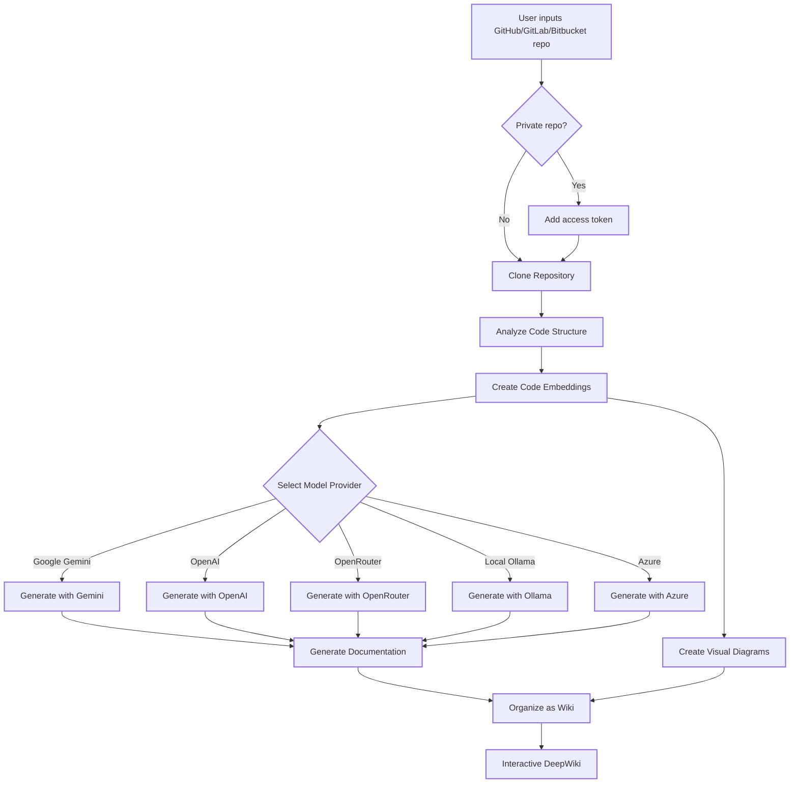

### ⚠️ Thông báo: Chuyển trọng tâm sang AsyncReview
---

**CẬP NHẬT QUAN TRỌNG** Việc bảo trì DeepWiki-Open vẫn đang tiếp tục, nhưng quá trình phát triển chính đang chuyển sang **[AsyncReview](https://github.com/AsyncFuncAI/AsyncReview/)**. Cảm ơn sự ủng hộ của các bạn dành cho dự án này; xin hãy tham gia cùng tôi tại repository mới cho nỗ lực chính của năm nay.

---
---

# DeepWiki-Open


**Open DeepWiki** là 1 triển khai thay thế cho DeepWiki, tự động tạo ra các trang wiki cho bất kỳ Repository nào trên GitHub, GitLab hoặc BitBucket! Chỉ cần nhập đường dẫn Repository, và DeepWiki sẽ:

1. Phân tích cấu trúc mã nguồn
2. Tạo tài liệu đầy đủ và chi tiết
3. Tạo sơ đồ trực quan để giải thích cách mọi thứ hoạt động
4. Sắp xếp tất cả documents thành một wiki dễ hiểu

[](https://buymeacoffee.com/sheing)
[](https://tip.md/sng-asyncfunc)
[](https://x.com/sashimikun_void)
[](https://discord.com/invite/VQMBGR8u5v)

[English](./README.md) | [简体中文](./README.zh.md) | [繁體中文](./README.zh-tw.md) | [日本語](./README.ja.md) | [Español](./README.es.md) | [한국어](./README.kr.md) | [Tiếng Việt](./README.vi.md) | [Português Brasileiro](./README.pt-br.md) | [Français](./README.fr.md) | [Русский](./README.ru.md)

## ✨ Tính năng

- **Tạo Tài liệu tức thì**: Biến bất kỳ Repository GitHub, GitLab hoặc BitBucket nào thành wiki chỉ trong vài giây
- **Hỗ trợ Private Repository**: Truy cập Private Repository một cách an toàn với personal access tokens
- **Phân tích thông minh**: Hiểu cấu trúc và mối quan hệ của source codes nhờ AI
- **Tự động tạo Sơ đồ**: Tự động tạo sơ đồ Mermaid để trực quan hóa kiến trúc và luồng dữ liệu
- **Dễ dàng thao tác**: Giao diện wiki đơn giản, trực quan để khám phá
- **Trò chuyện với repository**: Trò chuyện với repo của bạn bằng AI (tích hợp RAG) để nhận câu trả lời chính xác
- **DeepResearch**: Quy trình Deep Research nhiều bước giúp phân tích kỹ lưỡng các chủ đề phức tạp
- **Hỗ trợ nhiều mô hình**: Hỗ trợ Google Gemini, OpenAI, OpenRouter, và local Ollama models
- **Nhúng linh hoạt**: Lựa chọn giữa OpenAI, Google AI, hoặc Ollama embeddings cục bộ để đạt hiệu suất tối ưu

### Tính năng Doanh nghiệp

- **GitLab SSO**: Đăng nhập một lần dựa trên OAuth2 với các instance GitLab
- **Bảng điều khiển Quản trị**: Lập chỉ mục hàng loạt, quản lý dự án, giám sát hệ thống
- **MCP Server**: Endpoint [Model Context Protocol](https://modelcontextprotocol.io/) xác thực JWT — kết nối Claude Code, Codex hoặc bất kỳ MCP client nào để truy vấn codebase
- **Quản lý Sản phẩm**: Nhóm nhiều repository thành sản phẩm logic để phân tích xuyên repo
- **Quan hệ Repository**: Tự động trực quan hóa đồ thị phụ thuộc giữa các repository
- **Hỏi Toàn cục**: Hỏi đáp xuyên repo trên tất cả dự án đã lập chỉ mục
- **Phân tích Có cấu trúc**: LLM trích xuất module, API endpoint, mô hình dữ liệu, tech stack cho mỗi dự án
- **Hệ thống Phân quyền**: Kiểm soát truy cập dựa trên GitLab với bộ nhớ đệm (5 phút mỗi dự án, 24 giờ cho danh sách dự án)

## 🚀 Bắt đầu (Siêu dễ :))

### Option 1: Sử dụng Docker

```bash
# Clone repository
git clone https://github.com/AsyncFuncAI/deepwiki-open.git
cd deepwiki-open

# Tạo .env file với API keys
echo "GOOGLE_API_KEY=your_google_api_key" > .env
echo "OPENAI_API_KEY=your_openai_api_key" >> .env
# Tùy chọn: Dùng Google AI embeddings thay vì OpenAI (khuyên dùng nếu sử dụng mô hình Google)
echo "DEEPWIKI_EMBEDDER_TYPE=google" >> .env
# Tùy chọn: Thêm OpenRouter API key nếu bạn muốn dùng OpenRouter models
echo "OPENROUTER_API_KEY=your_openrouter_api_key" >> .env
# Tùy chọn: Thêm Ollama host nếu không chạy cục bộ. Mặc định http://localhost:11434
echo "OLLAMA_HOST=your_ollama_host" >> .env
# Tùy chọn: Thêm Azure API key, endpoint và version nếu bạn muốn dùng Azure OpenAI models
echo "AZURE_OPENAI_API_KEY=your_azure_openai_api_key" >> .env
echo "AZURE_OPENAI_ENDPOINT=your_azure_openai_endpoint" >> .env
echo "AZURE_OPENAI_VERSION=your_azure_openai_version" >> .env
# Run với Docker Compose
docker-compose up
```

Để xem hướng dẫn chi tiết về việc sử dụng DeepWiki với Ollama và Docker, xem [Hướng dẫn Ollama](Ollama-instruction.md).

> 💡 **Hướng dẫn lấy Keys**
> - Lấy Google API key từ [Google AI Studio](https://makersuite.google.com/app/apikey)
> - Lấy OpenAI API key từ [OpenAI Platform](https://platform.openai.com/api-keys)
> - Lấy thông tin Azure OpenAI từ [Azure Portal](https://portal.azure.com/) - tạo tài nguyên Azure OpenAI và lấy API key, endpoint, và API version

### Option 2: Setup thủ công (Khuyên dùng)

#### Bước 1: Set Up API Keys

Tạo `.env` file trong thư mục gốc của project với những keys vừa tạo:

```
GOOGLE_API_KEY=your_google_api_key
OPENAI_API_KEY=your_openai_api_key
# Tùy chọn: Dùng Google AI embeddings (khuyên dùng nếu sử dụng mô hình Google)
DEEPWIKI_EMBEDDER_TYPE=google
# Tùy chọn: Thêm nếu bạn muốn dùng OpenRouter models
OPENROUTER_API_KEY=your_openrouter_api_key
# Tùy chọn: Thêm nếu bạn muốn dùng Azure OpenAI models
AZURE_OPENAI_API_KEY=your_azure_openai_api_key
AZURE_OPENAI_ENDPOINT=your_azure_openai_endpoint
AZURE_OPENAI_VERSION=your_azure_openai_version
# Tùy chọn: Thêm Ollama host nếu không chạy cục bộ. Mặc định: http://localhost:11434
OLLAMA_HOST=your_ollama_host
```

#### Bước 2: Bắt đầu với Backend

```bash
# Cài đặt Python dependencies
python -m pip install poetry==2.0.1 && poetry install -C api

# Chạy API server
python -m api.main
```

#### Bước 3: Bắt đầu với Frontend

```bash
# Cài đặt JavaScript dependencies
npm install
# Hoặc
yarn install

# Chạy the web app
npm run dev
# Hoặc
yarn dev
```

#### Bước 4: Dùng DeepWiki!

1. Mở [http://localhost:3000](http://localhost:3000) trên trình duyệt
2. Nhập đường dẫn GitHub, GitLab, hoặc Bitbucket repository (ví dụ như `https://github.com/openai/codex`, `https://github.com/microsoft/autogen`, `https://gitlab.com/gitlab-org/gitlab`, hay `https://bitbucket.org/redradish/atlassian_app_versions`)
3. Cho private repositories, nhấn "+ Add access tokens" và nhập GitHub hoặc GitLab personal access token
4. Click "Generate Wiki" và xem kết quả!

## 🔍 Cách Open Deepwiki hoạt động

DeepWiki dùng AI để:

1. Clone và phân tích GitHub, GitLab, hoặc Bitbucket repository (bao gồm private repos với token authentication)
2. Tạo embeddings cho code để truy xuất thông minh
3. Tạo documentation với context-aware AI (dùng Google Gemini, OpenAI, OpenRouter, Azure OpenAI, hay local Ollama models)
4. Tạo diagrams để giải thích code relationships
5. Tổ chức thông tin thành 1 trang wiki có cấu trúc
6. Cho phép Q&A thông minh với repository qua tính năng Hỏi
7. Cung cấp khả năng nghiên cứu chuyên sâu với DeepResearch



## 🛠️ Cấu trúc dự án

```
deepwiki/
├── api/                        # Backend API server
│   ├── main.py                 # Điểm vào (uvicorn)
│   ├── api.py                  # Ứng dụng FastAPI, REST/WebSocket endpoints
│   ├── gitlab_auth.py          # GitLab OAuth2 SSO, JWT, MCP token
│   ├── gitlab_permission.py    # Kiểm tra quyền repo + bộ nhớ đệm
│   ├── admin.py                # API route quản trị
│   ├── batch_indexer.py        # Lập chỉ mục hàng loạt nền
│   ├── mcp_server.py           # MCP server (xác thực JWT)
│   ├── metadata_store.py       # Lưu trữ metadata JSON chỉ mục
│   ├── product_manager.py      # CRUD sản phẩm
│   ├── repo_relations.py       # Phân tích phụ thuộc repo
│   ├── insight_extractor.py    # Trích xuất kiến thức có cấu trúc
│   ├── wiki_generator.py       # Logic tạo wiki cốt lõi
│   ├── rag.py                  # RAG đơn repo
│   ├── multi_rag.py            # RAG đa repo
│   ├── data_pipeline.py        # Clone repo, tạo embeddings
│   ├── config.py               # Tải cấu hình, biến môi trường
│   ├── prompts.py              # Các mẫu prompt LLM
│   ├── config/                 # Tệp cấu hình JSON
│   └── *_client.py             # Client cho các nhà cung cấp LLM
│
├── src/                        # Frontend Next.js app
│   ├── app/
│   │   ├── page.tsx            # Trang chủ (đăng nhập SSO, danh sách dự án)
│   │   ├── [owner]/[repo]/     # Trình xem wiki
│   │   ├── admin/              # Bảng điều khiển quản trị
│   │   ├── admin/relations/    # Biểu đồ phụ thuộc repo
│   │   ├── ask/                # Hỏi Toàn cục (Q&A xuyên repo)
│   │   └── auth/callback/      # Callback OAuth
│   ├── components/             # Các component React
│   └── contexts/               # Auth, Language contexts
│
├── public/                     # Tài nguyên tĩnh
├── package.json                # JavaScript dependencies
└── .env                        # Biến môi trường (bạn cần tạo file này)
```

## 🤖 Hệ thống lựa chọn mô hình dựa trên nhà cung cấp

DeepWiki hiện đã triển khai một hệ thống lựa chọn mô hình linh hoạt dựa trên nhiều nhà cung cấp LLM:

### Các nhà cung cấp và mô hình được hỗ trợ

- **Google**: Mặc định là `gemini-2.5-flash`, cũng hỗ trợ `gemini-2.5-flash-lite`, `gemini-2.5-pro`, v.v.
- **OpenAI**: Mặc định là `gpt-5-nano`, cũng hỗ trợ `gpt-5`, `4o`, v.v.
- **OpenRouter**: Truy cập nhiều mô hình qua một API thống nhất, bao gồm Claude, Llama, Mistral, v.v.
- **Azure OpenAI**: Mặc định là `gpt-4o`, cũng hỗ trợ `o4-mini`, v.v.
- **Ollama**: Hỗ trợ các mô hình mã nguồn mở chạy cục bộ như `llama3`

### Biến môi trường

Mỗi nhà cung cấp yêu cầu các biến môi trường API key tương ứng:

```
# API Keys
GOOGLE_API_KEY=google_api_key_của_bạn        # Bắt buộc cho các mô hình Google Gemini
OPENAI_API_KEY=openai_key_của_bạn            # Bắt buộc cho các mô hình OpenAI
OPENROUTER_API_KEY=openrouter_key_của_bạn    # Bắt buộc cho các mô hình OpenRouter
AZURE_OPENAI_API_KEY=azure_openai_key_của_bạn  # Bắt buộc cho các mô hình Azure OpenAI
AZURE_OPENAI_ENDPOINT=azure_openai_endpoint_của_bạn  # Bắt buộc cho các mô hình Azure OpenAI
AZURE_OPENAI_VERSION=azure_openai_version_của_bạn  # Bắt buộc cho các mô hình Azure OpenAI

# Cấu hình URL cơ sở cho OpenAI API
OPENAI_BASE_URL=https://endpoint-tùy-chỉnh.com/v1  # Tùy chọn, cho các điểm cuối API OpenAI tùy chỉnh

# Ollama host
OLLAMA_HOST=ollama_host_của_bạn # Tùy chọn, nếu Ollama không chạy cục bộ. Mặc định: http://localhost:11434

# Thư mục cấu hình
DEEPWIKI_CONFIG_DIR=/đường/dẫn/đến/thư_mục/cấu_hình  # Tùy chọn, cho vị trí tệp cấu hình tùy chỉnh
```

### Tệp cấu hình

DeepWiki sử dụng các tệp cấu hình JSON để quản lý các khía cạnh khác nhau của hệ thống:

1. **`generator.json`**: Cấu hình cho các mô hình tạo văn bản
   - Xác định các nhà cung cấp mô hình có sẵn (Google, OpenAI, OpenRouter, Azure, Ollama)
   - Chỉ định các mô hình mặc định và có sẵn cho mỗi nhà cung cấp
   - Chứa các tham số đặc thù cho mô hình như temperature và top_p

2. **`embedder.json`**: Cấu hình cho mô hình embedding và xử lý văn bản
   - Xác định mô hình embedding cho lưu trữ vector
   - Chứa cấu hình bộ truy xuất cho RAG
   - Chỉ định cài đặt trình chia văn bản để phân đoạn tài liệu

3. **`repo.json`**: Cấu hình xử lý repository
   - Chứa bộ lọc tệp để loại trừ một số tệp và thư mục nhất định
   - Xác định giới hạn kích thước repository và quy tắc xử lý

Mặc định, các tệp này nằm trong thư mục `api/config/`. Bạn có thể tùy chỉnh vị trí của chúng bằng biến môi trường `DEEPWIKI_CONFIG_DIR`.

### Lựa chọn mô hình tùy chỉnh cho nhà cung cấp dịch vụ

Tính năng lựa chọn mô hình tùy chỉnh được thiết kế đặc biệt cho các nhà cung cấp dịch vụ cần:

- Bạn có thể cung cấp cho người dùng trong tổ chức của mình nhiều lựa chọn mô hình AI khác nhau
- Bạn có thể thích ứng nhanh chóng với môi trường LLM đang phát triển nhanh chóng mà không cần thay đổi mã
- Bạn có thể hỗ trợ các mô hình chuyên biệt hoặc được tinh chỉnh không có trong danh sách định nghĩa trước

Bạn có thể triển khai các mô hình cung cấp bằng cách chọn từ các tùy chọn định nghĩa trước hoặc nhập định danh mô hình tùy chỉnh trong giao diện người dùng.

### Cấu hình URL cơ sở cho các kênh riêng doanh nghiệp

Cấu hình base_url của OpenAI Client được thiết kế chủ yếu cho người dùng doanh nghiệp có các kênh API riêng. Tính năng này:

- Cho phép kết nối với các điểm cuối API riêng hoặc dành riêng cho doanh nghiệp
- Cho phép các tổ chức sử dụng dịch vụ LLM tự lưu trữ hoặc triển khai tùy chỉnh
- Hỗ trợ tích hợp với các dịch vụ tương thích API OpenAI của bên thứ ba

**Sắp ra mắt**: Trong các bản cập nhật tương lai, DeepWiki sẽ hỗ trợ chế độ mà người dùng cần cung cấp API key của riêng họ trong các yêu cầu. Điều này sẽ cho phép khách hàng doanh nghiệp có kênh riêng sử dụng cấu hình API hiện có mà không cần chia sẻ thông tin đăng nhập với triển khai DeepWiki.

## 🧩 Sử dụng mô hình Embedding tương thích OpenAI (ví dụ: Alibaba Qwen)

Nếu bạn muốn sử dụng các mô hình embedding tương thích với API OpenAI (như Alibaba Qwen), hãy làm theo các bước sau:

1. Thay thế nội dung của `api/config/embedder.json` bằng nội dung từ `api/config/embedder_openai_compatible.json`.
2. Trong file `.env` ở thư mục gốc dự án, đặt các biến môi trường tương ứng, ví dụ:
   ```
   OPENAI_API_KEY=api_key_của_bạn
   OPENAI_BASE_URL=endpoint_tương_thích_openai_của_bạn
   ```
3. Chương trình sẽ tự động thay thế các placeholder trong embedder.json bằng giá trị từ biến môi trường.

Điều này cho phép bạn chuyển đổi liền mạch sang bất kỳ dịch vụ embedding tương thích OpenAI nào mà không cần thay đổi mã.

## 🧠 Sử dụng Google AI Embeddings

DeepWiki hiện hỗ trợ mô hình embedding mới nhất của Google AI như một lựa chọn thay thế cho OpenAI embeddings. Điều này cung cấp tích hợp tốt hơn khi bạn đã sử dụng mô hình Google Gemini cho việc tạo văn bản.

### Tính năng

- **Mô hình mới nhất**: Sử dụng mô hình `text-embedding-004` của Google
- **Cùng API Key**: Sử dụng `GOOGLE_API_KEY` hiện có của bạn (không cần cài đặt thêm)
- **Tích hợp tốt hơn**: Tối ưu hóa cho việc sử dụng cùng mô hình tạo văn bản Google Gemini
- **Theo tác vụ**: Hỗ trợ các tác vụ tương đồng ngữ nghĩa, truy xuất và phân loại
- **Xử lý hàng loạt**: Xử lý hiệu quả nhiều văn bản cùng lúc

### Cách kích hoạt Google AI Embeddings

**Cách 1: Biến môi trường (Khuyên dùng)**

Đặt loại embedder trong file `.env`:

```bash
# Google API key hiện có của bạn
GOOGLE_API_KEY=google_api_key_của_bạn

# Kích hoạt Google AI embeddings
DEEPWIKI_EMBEDDER_TYPE=google
```

**Cách 2: Môi trường Docker**

```bash
docker run -p 8001:8001 -p 3000:3000 \
  -e GOOGLE_API_KEY=google_api_key_của_bạn \
  -e DEEPWIKI_EMBEDDER_TYPE=google \
  -v ~/.adalflow:/root/.adalflow \
  ghcr.io/asyncfuncai/deepwiki-open:latest
```

**Cách 3: Docker Compose**

Thêm vào file `.env`:

```bash
GOOGLE_API_KEY=google_api_key_của_bạn
DEEPWIKI_EMBEDDER_TYPE=google
```

Sau đó chạy:

```bash
docker-compose up
```

### Các loại Embedder có sẵn

| Loại | Mô tả | API Key cần thiết | Ghi chú |
|------|--------|-------------------|---------|
| `openai` | OpenAI embeddings (mặc định) | `OPENAI_API_KEY` | Sử dụng mô hình `text-embedding-3-small` |
| `google` | Google AI embeddings | `GOOGLE_API_KEY` | Sử dụng mô hình `text-embedding-004` |
| `ollama` | Ollama embeddings cục bộ | Không cần | Yêu cầu cài đặt Ollama cục bộ |

### Tại sao nên dùng Google AI Embeddings?

- **Tính nhất quán**: Nếu bạn đang dùng Google Gemini cho việc tạo văn bản, sử dụng Google embeddings mang lại tính nhất quán ngữ nghĩa tốt hơn
- **Hiệu suất**: Mô hình embedding mới nhất của Google có hiệu suất xuất sắc cho các tác vụ truy xuất
- **Chi phí**: Giá cả cạnh tranh so với OpenAI
- **Không cần cài đặt thêm**: Sử dụng cùng API key với mô hình tạo văn bản

### Chuyển đổi giữa các Embedder

Bạn có thể dễ dàng chuyển đổi giữa các nhà cung cấp embedding:

```bash
# Sử dụng OpenAI embeddings (mặc định)
export DEEPWIKI_EMBEDDER_TYPE=openai

# Sử dụng Google AI embeddings
export DEEPWIKI_EMBEDDER_TYPE=google

# Sử dụng Ollama embeddings cục bộ
export DEEPWIKI_EMBEDDER_TYPE=ollama
```

**Lưu ý**: Khi chuyển đổi embedder, bạn có thể cần tạo lại embeddings cho repository vì các mô hình khác nhau tạo ra các không gian vector khác nhau.

### Nhật ký (Logging)

DeepWiki sử dụng module `logging` tích hợp sẵn của Python cho đầu ra chẩn đoán. Bạn có thể cấu hình mức độ chi tiết và đích tệp nhật ký thông qua biến môi trường:

| Biến | Mô tả | Mặc định |
|------|--------|----------|
| `LOG_LEVEL` | Mức nhật ký (DEBUG, INFO, WARNING, ERROR, CRITICAL). | INFO |
| `LOG_FILE_PATH` | Đường dẫn tệp nhật ký. Nếu được đặt, nhật ký sẽ được ghi vào tệp này. | `api/logs/application.log` |

Để bật nhật ký debug và ghi vào tệp tùy chỉnh:
```bash
export LOG_LEVEL=DEBUG
export LOG_FILE_PATH=./debug.log
python -m api.main
```
Hoặc với Docker Compose:
```bash
LOG_LEVEL=DEBUG LOG_FILE_PATH=./debug.log docker-compose up
```

Khi chạy với Docker Compose, thư mục `api/logs` của container được bind-mount vào `./api/logs` trên máy chủ (xem phần `volumes` trong `docker-compose.yml`), đảm bảo các tệp nhật ký được giữ lại qua các lần khởi động lại.

Ngoài ra, bạn có thể lưu các thiết lập này trong file `.env`:

```bash
LOG_LEVEL=DEBUG
LOG_FILE_PATH=./debug.log
```
Sau đó chạy:

```bash
docker-compose up
```

**Lưu ý bảo mật đường dẫn nhật ký:** Trong môi trường production, hãy đảm bảo thư mục `api/logs` và bất kỳ đường dẫn tệp nhật ký tùy chỉnh nào đều được bảo mật với quyền truy cập hệ thống tệp phù hợp. Ứng dụng bắt buộc `LOG_FILE_PATH` phải nằm trong thư mục `api/logs` của dự án để ngăn chặn duyệt đường dẫn hoặc ghi trái phép.

## 🛠️ Cài đặt nâng cao

### Biến môi trường

| Biến | Mô tả | Bắt buộc | Ghi chú |
|---|---|---|---|
| **Nhà cung cấp LLM** ||||
| `GOOGLE_API_KEY` | Google Gemini API key | Không | Bắt buộc cho mô hình Gemini và Google embeddings |
| `OPENAI_API_KEY` | OpenAI API key | Có điều kiện | Bắt buộc nếu dùng OpenAI embeddings hoặc mô hình |
| `OPENROUTER_API_KEY` | OpenRouter API key | Không | Bắt buộc cho mô hình OpenRouter |
| `AZURE_OPENAI_API_KEY` | Azure OpenAI API key | Không | Bắt buộc cho mô hình Azure OpenAI |
| `AZURE_OPENAI_ENDPOINT` | Azure OpenAI endpoint | Không | Bắt buộc cho mô hình Azure OpenAI |
| `AZURE_OPENAI_VERSION` | Azure OpenAI version | Không | Bắt buộc cho mô hình Azure OpenAI |
| `OLLAMA_HOST` | Ollama Host (mặc định: http://localhost:11434) | Không | Bắt buộc cho Ollama server bên ngoài |
| `DEEPWIKI_EMBEDDER_TYPE` | Embedder: `openai`, `google`, `ollama`, `bedrock` | Không | Mặc định: `openai` |
| **AWS Bedrock** ||||
| `AWS_ACCESS_KEY_ID` | AWS access key | Không | Bắt buộc cho Bedrock không dùng xác thực role |
| `AWS_SECRET_ACCESS_KEY` | AWS secret key | Không | Bắt buộc cho Bedrock không dùng xác thực role |
| `AWS_REGION` | AWS region (mặc định: `us-east-1`) | Không | |
| `AWS_ROLE_ARN` | AWS role ARN để assume | Không | Nếu đặt, sử dụng STS AssumeRole |
| **GitLab Doanh nghiệp** ||||
| `GITLAB_URL` | URL instance GitLab | Không | Bắt buộc cho SSO và tính năng doanh nghiệp |
| `GITLAB_CLIENT_ID` | ID ứng dụng OAuth2 | Không | Bắt buộc cho GitLab SSO |
| `GITLAB_CLIENT_SECRET` | Secret ứng dụng OAuth2 | Không | Bắt buộc cho GitLab SSO |
| `GITLAB_SERVICE_TOKEN` | Token tài khoản dịch vụ | Không | Bắt buộc cho lập chỉ mục hàng loạt và truy cập MCP repo |
| `JWT_SECRET_KEY` | Secret ký JWT | Không | Bắt buộc khi bật SSO |
| `ADMIN_USERNAMES` | Danh sách username admin, phân cách bằng dấu phẩy | Không | Kiểm soát truy cập bảng điều khiển quản trị |
| `PERMISSION_CACHE_TTL` | TTL bộ nhớ đệm quyền (giây) | Không | Mặc định: 300 |
| `FRONTEND_ORIGIN` | URL frontend cho OAuth callbacks | Không | Mặc định: http://localhost:3000 |
| **Server** ||||
| `PORT` | Port API server (mặc định: 8001) | Không | |
| `SERVER_BASE_URL` | URL backend cho frontend proxy | Không | Mặc định: http://localhost:8001 |
| `DEEPWIKI_CONFIG_DIR` | Thư mục cấu hình tùy chỉnh | Không | Mặc định: `api/config/` |
| `DEEPWIKI_AUTH_MODE` | Bật chế độ mã xác thực (`true`/`1`) | Không | Xác thực đơn giản cho triển khai không dùng SSO |
| `DEEPWIKI_AUTH_CODE` | Mã xác thực cho việc tạo wiki | Không | Chỉ dùng với `DEEPWIKI_AUTH_MODE` |

**Yêu cầu API Key:**
- Nếu dùng `DEEPWIKI_EMBEDDER_TYPE=openai` (mặc định): Bắt buộc `OPENAI_API_KEY`
- Nếu dùng `DEEPWIKI_EMBEDDER_TYPE=google`: Bắt buộc `GOOGLE_API_KEY`
- Nếu dùng `DEEPWIKI_EMBEDDER_TYPE=ollama`: Không cần API key (xử lý cục bộ)
- Nếu dùng `DEEPWIKI_EMBEDDER_TYPE=bedrock`: Bắt buộc thông tin AWS (hoặc xác thực dựa trên role)

Các API key khác chỉ bắt buộc khi cấu hình và sử dụng mô hình từ nhà cung cấp tương ứng.

## Chế độ Xác thực

DeepWiki có thể được cấu hình để chạy ở chế độ xác thực, trong đó việc tạo wiki yêu cầu mã xác thực hợp lệ. Điều này hữu ích nếu bạn muốn kiểm soát ai có thể sử dụng tính năng tạo wiki.
Chế độ này hạn chế việc khởi tạo từ frontend và bảo vệ xóa bộ nhớ đệm, nhưng không hoàn toàn ngăn chặn việc tạo wiki từ backend nếu API endpoints bị gọi trực tiếp.

Để bật chế độ xác thực, đặt các biến môi trường sau:

- `DEEPWIKI_AUTH_MODE`: Đặt thành `true` hoặc `1`. Khi bật, frontend sẽ hiển thị ô nhập mã xác thực.
- `DEEPWIKI_AUTH_CODE`: Đặt thành mã bí mật mong muốn. Hạn chế việc khởi tạo từ frontend và bảo vệ xóa bộ nhớ đệm, nhưng không hoàn toàn ngăn chặn việc tạo wiki từ backend nếu API endpoints bị gọi trực tiếp.

Nếu `DEEPWIKI_AUTH_MODE` không được đặt hoặc đặt thành `false` (hoặc bất kỳ giá trị nào khác ngoài `true`/`1`), tính năng xác thực sẽ bị tắt và không cần mã.

### Cài Đặt với Docker

Bạn có thể dùng Docker để chạy DeepWiki:

#### Chạy Container

```bash
# Pull Docker image từ GitHub Container Registry
docker pull ghcr.io/asyncfuncai/deepwiki-open:latest

# Chạy container với biến môi trường
docker run -p 8001:8001 -p 3000:3000 \
  -e GOOGLE_API_KEY=your_google_api_key \
  -e OPENAI_API_KEY=your_openai_api_key \
  -e OPENROUTER_API_KEY=your_openrouter_api_key \
  -e OLLAMA_HOST=your_ollama_host \
  -e AZURE_OPENAI_API_KEY=your_azure_openai_api_key \
  -e AZURE_OPENAI_ENDPOINT=your_azure_openai_endpoint \
  -e AZURE_OPENAI_VERSION=your_azure_openai_version \

  -v ~/.adalflow:/root/.adalflow \
  ghcr.io/asyncfuncai/deepwiki-open:latest
```

Lệnh này cũng mount `~/.adalflow` trên máy chủ vào `/root/.adalflow` trong container. Đường dẫn này được sử dụng để lưu trữ:
- Repository đã clone (`~/.adalflow/repos/`)
- Embeddings và indexes (`~/.adalflow/databases/`)
- Nội dung wiki đã tạo và cache (`~/.adalflow/wikicache/`)

Điều này đảm bảo dữ liệu của bạn được giữ lại ngay cả khi container bị dừng hoặc xóa.

Hoặc sử dụng file `docker-compose.yml` đã cung cấp sẵn:

```bash
# Chỉnh sửa file .env với API keys trước
docker-compose up
```

(File `docker-compose.yml` đã được cấu hình sẵn để mount `~/.adalflow` cho việc lưu trữ dữ liệu bền vững, tương tự lệnh `docker run` ở trên.)

#### Sử dụng .env file với Docker

Bạn có thể mount .env file vào container:

```bash
# Tạo .env file với API keys
echo "GOOGLE_API_KEY=your_google_api_key" > .env
echo "OPENAI_API_KEY=your_openai_api_key" >> .env
echo "OPENROUTER_API_KEY=your_openrouter_api_key" >> .env
echo "AZURE_OPENAI_API_KEY=your_azure_openai_api_key" >> .env
echo "AZURE_OPENAI_ENDPOINT=your_azure_openai_endpoint" >> .env
echo "AZURE_OPENAI_VERSION=your_azure_openai_version"  >>.env
echo "OLLAMA_HOST=your_ollama_host" >> .env

# Chạy container với .env file
docker run -p 8001:8001 -p 3000:3000 \
  -v $(pwd)/.env:/app/.env \
  -v ~/.adalflow:/root/.adalflow \
  ghcr.io/asyncfuncai/deepwiki-open:latest
```

Lệnh này cũng mount `~/.adalflow` trên máy chủ vào `/root/.adalflow` trong container. Đường dẫn này được sử dụng để lưu trữ:
- Repository đã clone (`~/.adalflow/repos/`)
- Embeddings và indexes (`~/.adalflow/databases/`)
- Nội dung wiki đã tạo và cache (`~/.adalflow/wikicache/`)

Điều này đảm bảo dữ liệu của bạn được giữ lại ngay cả khi container bị dừng hoặc xóa.

#### Build Docker image trên máy cục bộ

Nếu bạn muốn build Docker image cục bộ:

```bash
# Clone repository
git clone https://github.com/AsyncFuncAI/deepwiki-open.git
cd deepwiki-open

# Build Docker image
docker build -t deepwiki-open .

# Chạy container
docker run -p 8001:8001 -p 3000:3000 \
  -e GOOGLE_API_KEY=your_google_api_key \
  -e OPENAI_API_KEY=your_openai_api_key \
  -e OPENROUTER_API_KEY=your_openrouter_api_key \
  -e AZURE_OPENAI_API_KEY=your_azure_openai_api_key \
  -e AZURE_OPENAI_ENDPOINT=your_azure_openai_endpoint \
  -e AZURE_OPENAI_VERSION=your_azure_openai_version \
  -e OLLAMA_HOST=your_ollama_host \
  deepwiki-open
```

#### Sử dụng chứng chỉ tự ký trong Docker

Nếu bạn đang ở môi trường sử dụng chứng chỉ tự ký, bạn có thể đưa chúng vào bản build Docker:

1. Tạo thư mục cho chứng chỉ (mặc định là `certs` trong thư mục gốc dự án)
2. Sao chép các tệp chứng chỉ `.crt` hoặc `.pem` vào thư mục này
3. Build Docker image:

```bash
# Build với thư mục chứng chỉ mặc định (certs)
docker build .

# Hoặc build với thư mục chứng chỉ tùy chỉnh
docker build --build-arg CUSTOM_CERT_DIR=my-custom-certs .
```

### Chi tiết API Server

API server cung cấp:
- Repository cloning và indexing
- RAG (Retrieval Augmented Generation)
- Trò chuyện liên tục

Biết thêm chi tiết truy cập [API README](./api/README.md).

## 🔌 Tích hợp OpenRouter

DeepWiki hiện đã hỗ trợ [OpenRouter](https://openrouter.ai/) làm nhà cung cấp mô hình, cho phép bạn truy cập hàng trăm mô hình AI thông qua một API duy nhất:

- **Nhiều tùy chọn mô hình**: Truy cập các mô hình từ OpenAI, Anthropic, Google, Meta, Mistral và nhiều nhà cung cấp khác
- **Cấu hình đơn giản**: Chỉ cần thêm khóa API của bạn từ OpenRouter và chọn mô hình bạn muốn sử dụng
- **Tiết kiệm chi phí**: Lựa chọn mô hình phù hợp với ngân sách và nhu cầu hiệu suất của bạn
- **Chuyển đổi dễ dàng**: Chuyển đổi giữa các mô hình khác nhau mà không cần thay đổi mã nguồn

### Cách sử dụng OpenRouter với DeepWiki

1. **Lấy API Key**: Đăng ký tại [OpenRouter](https://openrouter.ai/) và lấy khóa API
2. **Thêm vào biến môi trường**: Thêm `OPENROUTER_API_KEY=your_key` vào file `.env`
3. **Bật trong giao diện**: Chọn "Use OpenRouter API" trên trang chủ
4. **Chọn mô hình**: Lựa chọn từ các mô hình phổ biến như GPT-4o, Claude 3.5 Sonnet, Gemini 2.0 và nhiều hơn nữa

OpenRouter đặc biệt hữu ích nếu bạn muốn:
- Thử nhiều mô hình khác nhau mà không cần đăng ký nhiều dịch vụ
- Truy cập các mô hình có thể bị giới hạn tại khu vực của bạn
- So sánh hiệu năng giữa các nhà cung cấp mô hình khác nhau
- Tối ưu hóa chi phí so với hiệu suất dựa trên nhu cầu của bạn

## 🤖 Tính năng Hỏi & Nghiên cứu Sâu (DeepResearch)

### Tính năng Hỏi (Ask)

Tính năng Hỏi cho phép bạn trò chuyện với kho mã của mình bằng cách sử dụng kỹ thuật RAG (Retrieval Augmented Generation):

- **Phản hồi theo ngữ cảnh**: Nhận câu trả lời chính xác dựa trên mã thực tế trong kho của bạn
- **Ứng dụng RAG**: Hệ thống truy xuất các đoạn mã liên quan để tạo ra câu trả lời có cơ sở
- **Phản hồi theo thời gian thực**: Xem câu trả lời được tạo ra trực tiếp, mang lại trải nghiệm tương tác hơn
- **Lưu lịch sử cuộc trò chuyện**: Hệ thống duy trì ngữ cảnh giữa các câu hỏi để cuộc đối thoại liền mạch hơn

### Tính năng DeepResearch

DeepResearch nâng tầm phân tích kho mã với quy trình nghiên cứu nhiều vòng:

- **Nghiên cứu chuyên sâu**: Khám phá kỹ lưỡng các chủ đề phức tạp thông qua nhiều vòng nghiên cứu
- **Quy trình có cấu trúc**: Tuân theo kế hoạch nghiên cứu rõ ràng với các bản cập nhật và kết luận tổng thể
- **Tự động tiếp tục**: AI sẽ tự động tiếp tục quá trình nghiên cứu cho đến khi đưa ra kết luận (tối đa 5 vòng)
- **Các giai đoạn nghiên cứu**:
  1. **Kế hoạch nghiên cứu**: Phác thảo phương pháp và những phát hiện ban đầu
  2. **Cập nhật nghiên cứu**: Bổ sung kiến thức mới qua từng vòng lặp
  3. **Kết luận cuối cùng**: Đưa ra câu trả lời toàn diện dựa trên tất cả các vòng nghiên cứu

Để sử dụng DeepResearch, chỉ cần bật công tắc "Deep Research" trong giao diện Hỏi (Ask) trước khi gửi câu hỏi của bạn.

## 🏢 Tích hợp GitLab Doanh nghiệp

DeepWiki hỗ trợ triển khai doanh nghiệp đầy đủ với GitLab làm nhà cung cấp xác thực và repository.

### Thiết lập GitLab SSO

1. Tạo ứng dụng OAuth2 trong GitLab (Admin > Applications):
   - **Redirect URI**: `http://your-frontend:3000/auth/gitlab/callback`
   - **Scopes**: `read_user`, `read_api`
2. Đặt biến môi trường:
   ```bash
   GITLAB_URL=https://gitlab.example.com
   GITLAB_CLIENT_ID=app_id_của_bạn
   GITLAB_CLIENT_SECRET=app_secret_của_bạn
   JWT_SECRET_KEY=secret_ngẫu_nhiên_của_bạn
   FRONTEND_ORIGIN=http://your-frontend:3000
   ADMIN_USERNAMES=admin_user1,admin_user2
   ```
3. Để lập chỉ mục hàng loạt và truy cập MCP server, tạo token tài khoản dịch vụ với scope `read_api`:
   ```bash
   GITLAB_SERVICE_TOKEN=glpat-xxxxxxxxxxxx
   ```

### Bảng điều khiển Quản trị

Truy cập tại `/admin` cho người dùng trong `ADMIN_USERNAMES`:
- **Dự án đã lập chỉ mục**: Xem, lập chỉ mục lại, hoặc xóa các repository đã lập chỉ mục
- **Lập chỉ mục hàng loạt**: Chọn và lập chỉ mục nhiều dự án GitLab cùng lúc
- **Sản phẩm**: Nhóm các repository thành sản phẩm logic để phân tích xuyên repo
- **Thống kê hệ thống**: Kích thước bộ nhớ đệm, trạng thái lập chỉ mục, tổng quan cấu hình

### Quan hệ Repository

Có sẵn tại `/admin/relations`:
- Phát hiện phụ thuộc tự động thông qua quét import hỗ trợ bởi LLM
- Biểu đồ phụ thuộc tương tác (ReactFlow) với các chế độ xem nhóm/tập trung/toàn bộ
- Lọc cạnh và trực quan hóa phụ thuộc xuyên repo

## 🔌 Tích hợp MCP Server

DeepWiki cung cấp endpoint [MCP](https://modelcontextprotocol.io/) đã xác thực tại `/mcp`, cho phép các AI agent bên ngoài tận dụng codebase đã được lập chỉ mục của bạn.

### Công cụ có sẵn

| Công cụ | Mô tả |
|---------|-------|
| `list_products` | Liệt kê tất cả sản phẩm đã định nghĩa cùng các repo |
| `get_product_overview` | Tổng quan tổng hợp trên tất cả repo trong một sản phẩm |
| `search_product_code` | Tìm kiếm mã ngữ nghĩa trên tất cả repo của sản phẩm |
| `ask_product` | Đặt câu hỏi trên tất cả repo trong một sản phẩm |
| `list_projects` | Liệt kê tất cả dự án đã lập chỉ mục cùng trạng thái |
| `get_wiki_summary` | Lấy cấu trúc wiki và tiêu đề trang |
| `get_wiki_page` | Đọc toàn bộ nội dung trang wiki |
| `search_code` | Tìm kiếm mã ngữ nghĩa trong một dự án đơn lẻ |
| `get_repo_relations` | Lấy các quan hệ phụ thuộc |
| `ask_question` | Hỏi về codebase của một dự án đơn lẻ |
| `get_project_insights` | Lấy chỉ mục kiến thức có cấu trúc |
| `extract_project_insights` | Trích xuất thông tin chi tiết qua LLM |
| `get_product_insights` | Thông tin chi tiết tổng hợp trên toàn sản phẩm |

### Kết nối Claude Code

1. Đăng nhập vào DeepWiki thông qua GitLab SSO
2. Nhấn biểu tượng khóa trong thanh điều hướng để lấy MCP token
3. Chạy lệnh được tạo:
   ```bash
   claude mcp add --transport http deepwiki http://your-server:8001/mcp \
     --header "Authorization: Bearer <mcp-token-của-bạn>"
   ```
4. Claude Code giờ có thể truy vấn codebase đã lập chỉ mục của bạn

## 📱 Ảnh chụp màn hình


*Giao diện chính của DeepWiki*


*Truy cập kho riêng tư bằng Personal Access Token*


*DeepResearch thực hiện nghiên cứu nhiều vòng cho các chủ đề phức tạp*

### Demo Video

[](https://youtu.be/zGANs8US8B4)

*Xem DeepWiki hoạt động!*

## ❓ Khắc phục sự cố

### Vấn đề với API Key
- **"Thiếu biến môi trường"**: Đảm bảo rằng file `.env` của bạn nằm ở thư mục gốc của dự án và chứa các API key cần thiết
- **"API key không hợp lệ"**: Kiểm tra lại xem bạn đã sao chép đầy đủ API key mà không có khoảng trắng thừa chưa
- **"Lỗi API OpenRouter"**: Xác minh rằng API key của OpenRouter là hợp lệ và có đủ tín dụng
- **"Lỗi Azure OpenAI API"**: Xác minh thông tin Azure OpenAI (API key, endpoint và version) là chính xác và dịch vụ đã được triển khai đúng

### Vấn đề kết nối
- **"Không thể kết nối với máy chủ API"**: Đảm bảo máy chủ API đang chạy trên cổng 8001
- **"Lỗi CORS"**: API được cấu hình để cho phép tất cả các nguồn gốc, nhưng nếu gặp sự cố, thử chạy cả frontend và backend trên cùng một máy tính

### Vấn đề khi tạo nội dung
- **"Lỗi khi tạo wiki"**: Với các kho mã rất lớn, hãy thử trước với kho mã nhỏ hơn
- **"Định dạng kho mã không hợp lệ"**: Đảm bảo bạn đang sử dụng định dạng URL hợp lệ cho GitHub, GitLab hoặc Bitbucket
- **"Không thể lấy cấu trúc kho mã"**: Với các kho mã riêng tư, hãy đảm bảo bạn đã nhập token truy cập cá nhân hợp lệ và có quyền truy cập phù hợp
- **"Lỗi khi render sơ đồ"**: Ứng dụng sẽ tự động thử khắc phục các sơ đồ bị lỗi

### Các giải pháp phổ biến
1. **Khởi động lại cả hai máy chủ**: Đôi khi, một lần khởi động lại đơn giản có thể giải quyết hầu hết các vấn đề
2. **Kiểm tra nhật ký trình duyệt**: Mở công cụ phát triển của trình duyệt để xem các lỗi JavaScript
3. **Kiểm tra nhật ký API**: Xem các lỗi Python trong terminal nơi API đang chạy

## 🤝 Đóng góp

Chúng tôi hoan nghênh mọi đóng góp! Bạn có thể:
- Mở các vấn đề (issues) để báo lỗi hoặc yêu cầu tính năng
- Gửi pull request để cải thiện mã nguồn
- Chia sẻ phản hồi và ý tưởng của bạn

## 📄 Giấy phép

Dự án này được cấp phép theo Giấy phép MIT - xem file [LICENSE](LICENSE) để biết chi tiết.

## ⭐ Lịch sử

[](https://star-history.com/#AsyncFuncAI/deepwiki-open&Date)
